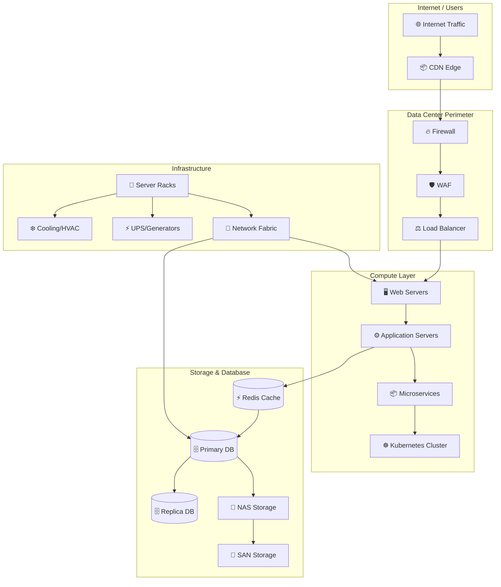
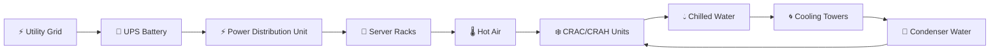

# Data-Centers

The presentation of the university subject "Distributed Generation" regarding data centers. 

## Structure

## Cooling

Sources
- [Marp Customization][1]

[1]: https://chris-ayers.com/posts/customizing-marp/ "Unleash Your Creativity with Marp Presentation Customization - By Chris Ayers"
