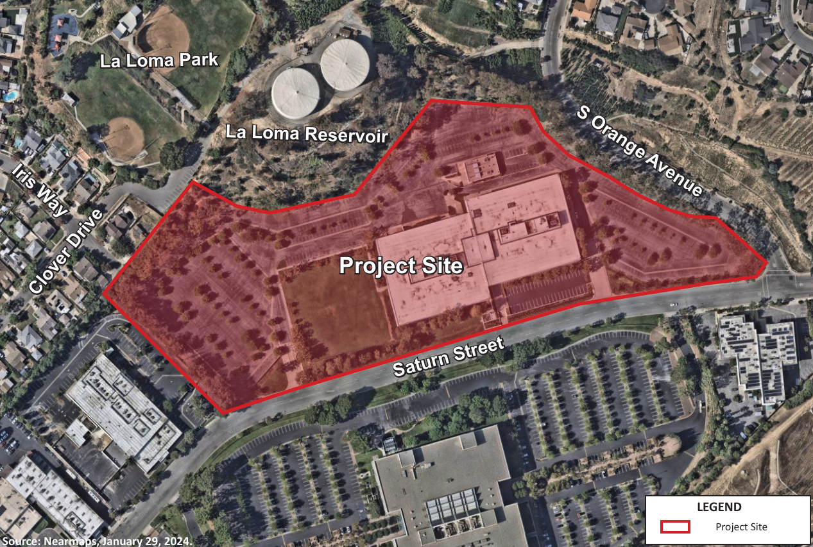
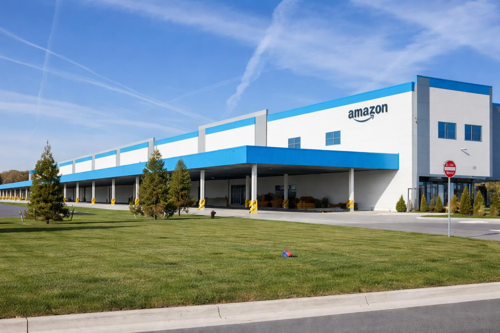

# 
 Post AI Era Datacenters Deepdive 

Papadakis Konstantinos Fotios
AEM: 10371

---

## Contents <i class="fa-solid fa-list"></i>

1. [Status quo](#status-quo)
2. [Datacenters Pillars](#new-datacenters)
3. [Energy Requirements](#energy-requirements)
4. [Network topology](#network--topology)
5. [Environmental Impact](#environmental-impact)
7. [Health](#health-effects)
8. [Finance](#finance)
9. [Sociopolitical Aspect](#sociopolitical--aspect)

---

# Status Quo <i class="fa-solid fa-bomb"></i>

What's the driving force of datacenter construction and expansions?

---

## Artificial Intelligence <i class="fa-brands fa-openai"></i>

- There always were Datacenters
- Many ambitious datacenter projects
- Focus on new facilities and expansions post AI era
- Push towards AGI
- Technology replacing humans in most fields
- note-to-self: why does the AI crisis seem to be different than technology not creating that many new jobs?

---

# New Datacenters <i class="fa-solid fa-server"></i>

The datacenters that are responsible for running and training the worlds most advanced LLMs.

---

## Map

Most Activity

|<i class="fa-solid fa-ranking-star"></i>  | State |
|-|-|
| 1 |Virginia |
| 2 |Texas |
| 3 |California |
| 4 |Illinois |
| 5 |Ohio |

---

## LLM Facilities <i class="fa-solid fa-industry"></i>

| Datacenter | Location | Company | LLM |
| ---------- | -------- | ------- | --- |
| Canton Facility | Mississipi | Amazon | - |
| Monterey Park Data Center | California | California | - |
| Stargate Project | Saline Township, Michigan | OpenAI, Oracle | - |
| Colossus | Memphis | xAI | |

---

## 
 Stargate 
 

---

## Specifications <i class="fa-solid fa-file-pen"></i>

<!-- Column 1 -->

| Specs      | Value          |
|------------|----------------|
| Investment | $500 billion   |
| Location   | Abilene, Texas |
| Company    | OpenAI & Oracle|
| IT Capacity | 4.5 GW |

based on [10][10]

<!-- Column 2 -->

5 new sites
- Shackelford County, Texas
- Milam County, Texas
- Doña Ana County, New Mexico
- Lordstown, Ohio
- a mystery site located somewhere in America's Midwest.

End goal being 10GW of combined capacity.

---

## Chips

- Nvidia GB200 racks

---

## Monterey Park Datacenter

---

## Specifications <i class="fa-solid fa-file-pen"></i>

<!-- Column 1 -->

| Specs      | Value          |
|------------|----------------|
| Investment |  |
| Location   |  |
| Company    |  |
| IT Capacity |  |

<!-- Column 2 -->

---

## Canton Amazon

---

## Specifications <i class="fa-solid fa-file-pen"></i>

<!-- Column 1 -->

| Specs      | Value          |
|------------|----------------|
| Investment | $10 billion   |
| Location   | Canton, Mississipi |
| Company    | Amazon |
| IT Capacity |  |

---

## Colossus

---

## Specifications <i class="fa-solid fa-file-pen"></i>

<!-- Column 1 -->

| Specs      | Value          |
|------------|----------------|
| Investment |   |
| Location   |  |
| Company    | xAI |
| IT Capacity |  |

<!-- Column 2 -->
~110,000 NVIDIA GB200 NVL72 GPUs (targeting 1.1 PFlops FP8 compute).
usually small fp numbers needed for 

---

# Energy Requirements <i class="fa-solid fa-bolt"></i>

Ways to fullfil the insatiable hunger of datacenters for electricity.

---

## Local Energy source candidates 

City main line <u>isn't enough</u>. This necessitates the use of backup turbines power by:
- **Diesel**
- **Field gas**: Gas extracted from a production well before it enters a natural gas processing plant [31][31].
- **CNG**: <mark>Compressed Natural Gas</mark>, mainly methane compressed at a pressure of 200 to 248 bars [32][32].
- **LPG**: <mark>Liquefied Petroleum Gas</mark>, a mixture of propane and butane liquefied at 15 °C and a pressure of 1.7-7.5 bars [32][32].
- **LowBTU gases**: Natural gas, which at the wellhead has a gross heating value $\le 450$ BTU. Part of petroleum refining and crude oil, natural gas production.

---

## Fuel Comparison <i class="fa-solid fa-square-poll-horizontal"></i>

| Comparison | CNG | LPG |
| ---------- | --- | --- |
| Constituents | Methane | Propane, Butane|
| Energy density | Lower caloric value | Higher caloric value |
| Cost | Cheaper | More expensive |
| Emissions| Less than LPG | Less than gasoline |
| Safety | Disperses quickly | Settles to ground, but highly inflammable |

CNG risk of ignition is low so even though LPG is highly inflammable it is the more likely of the two to ignite.

---

## Diesel Engine Turbines <i class="fa-solid fa-gas-pump"></i>

Monterey Park Data Center , Canton Mississippi 

---

## Methane Gas Turbines <i class="fa-solid fa-gas-pump"></i>

Colossus specifications
- natural gas turbines for primary generation
- batteries for stability
- grid for long-term scalability

Elon Musk's xAI data center Methane gas turbines, Colossus. [24][24]

- 7 Solar Turbines Titan-350 [22][22]
- 12 Solar Turbines SMT-130 [23][23]

Solar Turbines: a Caterpillar subsidiary

---

## Solar Turbines Titan 350

<!-- Column 1 -->

|Specifications|Value|
|-|-|
|Power output|35-39MW|
|Thermal efficiency|~40%|
|Fuel types| Natural gas, Propane, Low BTU gases |

source[22][22], [24][24], [27][27] 

---

## Solar Turbines Titan 350

|Advanced Specifications|Value|
|-|-|
|Heat Rate| 8845 kJ/kW-hr - 8780 kJ/kW-hr |
|Exhaust Flow| 371980 kg/hr - 387820 kg/hr|
|Exhaust Temp| 460°C - 490°C|
|Emissions | 25 PPM NOx |

---

## Solar Turbines SMT 130

<!-- Column 1 -->

|Specification|Value|
|-|-|
|Power output|16MW|
|Thermal eff.|~36%|
|Fuel types| Field Gas, CNG, LPG |
|Heat Rate| 10160 kJ/kWe-hr |
|Exhaust Flow|202510 kg/hr|
|Exhaust T| 490°C|
|Emissions | 25 PPM NOx |

Fully-Integrated Mobile Power Plant *Powered by Titan 130* [23][23], [24][24], [28][28]
<mark> <i class="fa-solid fa-plus"></i>Added Diesel fuel support</mark>

---

## SoloNOx

SoloNOx is the technology enabling Solar Turbines to reduce NOx and CO emissions.[30][30]

Offers a robust:
- 9ppm NOx, 
- 15ppm CO, and 
- 15 ppm UHC 

emissions warranty for natural gas fuel.

---

## Available power

SMT 130 supports Diesel fuel boosting for added flexibility.

Titan 130 available power graph

Colossus power generation around 1.1 GW by Q2 2027

---

## Tesla Megapacks 

Megapacks are large scale energy storage. <mark>*Many many* Batteries</mark>

Used for:
- Power Backup 
- Resilience for outages
- Demand-response
- Turbine ramping

They can provide 4 hours of power. They are planing to deploy 200 megapack for about 1 gigawatt hour of buffering. Long term solar powered facility but near-term it is Megapacks and gas turbines that is being used as a bridge to the future.

---

## Sustainable Pledges <i class="fa-solid fa-solar-panel"></i>

---

# Network $\quad$ topology <i class="fa-solid fa-network-wired"></i>

Network topology optimization

---

How are the cables routed 

---

# Environmental Impact <i class="fa-solid fa-leaf"></i>

- diesel generators spike local NOx levels

---

## Water Shortage <i class="fa-solid fa-droplet"></i>

---

## Energy sources and emissions <i class="fa-solid fa-smog"></i>

Electricity-generating turbines were exempt from requirements for air quality permits. [14][14]

loophole allowing the operation of generators without permits so long as the machines did not sit in one place for more than 364

xAI eventually received permits for 15 turbines at Colossus 1 and is now operating 12 permitted machines at the site.

- Net annual nitrogen oxide emission reductions of up to 296 tons by 2032,” [4][4]

---

# Health Effects <i class="fa-solid fa-heart-pulse"></i>

---

## Canton

Residents reported:
- lung irritation, 
- breathing difficulties, and 
- construction dust that settled over homes and playgrounds. 
- Cooling towers pull millions of gallons of water daily from the already-stressed Big Black River system, 
- while weekly tests of backup diesel generators spike local NOx levels and worsen the area’s elevated childhood asthma rates. [6][6]

---

## Infrasound <i class="fa-solid fa-wave-square"></i>

<!-- Column 1 -->

- Sound waves who's frequency is below the lower limit of human hearing (around 20Hz)  [1][1]
- 

<!-- Column 2 -->

### Known Health Effects [13][13]

- Spike in cortisol levels (stress, hyppertension) [14][14], [15][15]
- Nausea, Dizziness[12][12]
- Vibroacoustic disease [16][16]
- High frequency hearing loss [17][17]
- Shortness of breath [18][18]
- Anxiety, Depression [19][19]

---

## Sustained audible noise pollution <i class="fa-solid fa-ear-listen"></i>

---

## Methane gas

- Methane gas turbines pump harmful nitrogen oxides (mainly $NO_2$) into the air, which are known to cause:
    - Cancer
    - Asthma
    - Respiratory diseases [4][4], [26][26]

---

# Finance <i class="fa-solid fa-money-bill"></i>

---

- Monopolizing goods for consumers leading to cost skyrocketting
    - Ram & Hard disk prices
- shift towards subscription based models and away from owning based logic

---

# Sociopolitical $\quad$ Aspects <i class="fa-solid fa-scale-balanced"></i>

---

## Job Creation <i class="fa-solid fa-briefcase"></i>

- Stargate
- **100,000–200,000** construction and operations jobs [9][9]
- **~25,000** onsite jobs [11][11]
- But large automated data centers often need *only dozens* of permanent staff once built. 
- Abilene’s first facility may only employ **~57** ongoing workers, despite promises of thousands [12][12]

---

## Strategic Placement <i class="fa-solid fa-republican"></i>

- On democrat states
- Low backlash from the community
-   

---

## Worries about ownership

- Shift towards cloud computing
- Subscription based models
- 

<!-- ################# Sources ################# -->

[1]: https://youtu.be/_bP80DEAbuo "Datacenters Behaving Like Acoustic Weapons - Benn Jordan 2026"

[2]: https://sustainabilitydialogue.uchicago.edu/news/data-centers-pollution-and-the-communities-left-behind/ "Data Centers, Pollution, and the Communities Left Behind - The University of Chicago"

[3]: https://doi.org/10.1016/j.rser.2015.12.283 "Optimizing energy consumption for data centers"

[4]: https://www.theguardian.com/technology/2026/jan/15/elon-musk-xai-datacenter-memphis "Elon Musk’s xAI datacenter generating extra electricity illegally, regulator rules - TheGuardian"

[5]: https://sustainabilitydialogue.uchicago.edu/news/data-centers-pollution-and-the-communities-left-behind/ "Data Centers, Pollution, and the Communities Left Behind"

[6]: https://www.mississippifreepress.org/amazons-canton-data-center-promises-prosperity-for-neighbors-its-bringing-dust-noise-and-pollution-fears/ "Amazon’s Canton Data Center Promises Prosperity. For Neighbors, It’s Bringing Dust, Noise and Pollution Fears."

[7]: https://www.theguardian.com/us-news/2026/feb/07/california-monterey-park-stop-datacenter-construction "Rage against the machine: a California community rallied against a datacenter and won - TheGuardian"

[8]: https://www.theguardian.com/us-news/2025/dec/18/michigan-data-center-fight "‘Uniquely evil’: Michigan residents fight against huge datacenter backed by top tycoons - TheGuardian"

[9]: https://intuitionlabs.ai/articles/openai-stargate-datacenter-details "OpenAI’s Stargate Project: A Guide to the AI Infrastructure - Intuition Labs"

[10]: https://www.blackridgeresearch.com/blog/upcoming-largest-data-center-projects-in-united-states-usa "Blackridge Research - K.Vaishnavi Srivalli"

[11]: https://www.theregister.com/2025/09/24/openai_oracle_softbank_datacenters/#:~:text=While%20OpenAI%20claims%20the%20new,%C2%AE "OpenAI's Stargate project to pave the world with AI datacenters announces five new US locations - The Register"

[12]: https://www.cnbc.com/2025/02/06/openai-looking-at-16-states-for-data-center-campuses-tied-to-stargate.html#:~:text=The%20company%20also%20said%20it,jobs%2C%20according%20to%20recent%20reports "OpenAI considering 16 states for data center campuses as part of Trump’s Stargate project - CNBC"

[13]: https://doi.org/10.3390/ijerph20053916 "Low-Frequency Noise: Experiences from a Low-Frequency Noise Perceiving Population - PubMed"

[14]: https://doi.org/10.1016/j.neuroscience.2010.02.060 "Involvement of microglial cells in infrasonic noise-induced stress via upregulated expression of corticotrophin releasing hormone type 1 receptor - PubMed"

[15]: https://doi.org/10.1016/s0024-3205(01)01450-3 "Low frequency noise enhances cortisol among noise sensitive subjects during work performance - Science Direct" 

[16]: https://doi.org/10.1016/j.pbiomolbio.2006.07.011 "Vibroacoustic disease: Biological effects of infrasound and low-frequency noise explained by mechanotransduction cellular signalling - Science Direct"

[17]: https://doi.org/10.1016/j.heares.2007.01.016 "Effect of infrasound on cochlear damage from exposure to a 4-kHz octave band of noise - NIH"

[18]: https://pubmed.ncbi.nlm.nih.gov/15703146/ "Effects of low frequency noise on man, a case study - NIH"

[19]: https://doi.org/10.1038/s41598-021-82203-6 "A longitudinal, randomized experimental pilot study to investigate the effects of airborne infrasound on human mental health, cognition, and brain structure - NIH"

[20]: https://openai.com/index/five-new-stargate-sites/ "OpenAI, Oracle, and SoftBank expand Stargate with five new AI data center sites - OpenAI"

[21]: https://openai.com/index/stargate-advances-with-partnership-with-oracle/ "Stargate advances with 4.5 GW partnership with Oracle - OpenAI"

[22]: https://s7d2.scene7.com/is/content/Caterpillar/CM20220318-18bf4-966d4 "Titan 350, Gas Turbine Compressor Set - Solar Turbines"

[23]: https://s7d2.scene7.com/is/content/Caterpillar/CM20201215-9943b-379e0 "SMT130, SOLAR MOBILE TURBOMACHINERY - Solar Turbines"

[24]: https://www.nextbigfuture.com/2025/09/xai-colossus-2-first-gigawatt-ai-data-center.html "XAI Colossus 2 First Gigawatt AI Data Center - nextBIGFUTURE"

[25]: https://www.sgvtribune.com/2025/12/04/monterey-park-pauses-vote-on-massive-proposed-data-center-as-questions-linger-over-impact/ "Monterey Park pauses vote on massive proposed data center, as questions linger over impact - San Gabriel Valley Tribune"

[26]: http://dx.doi.org/10.20431/2456-0596.0204008 "Public Health Issues from the Exposure to Nitrogen Oxides: A Brief Review - ARC Journal of Public Health and Community Medicine"

[27]: https://www.solarturbines.com/en_US/products/power-generation-packages/titan-350-38mw.html#tabs-f0c2557302-item-180d94bbbb-tab "Titan 350, 38 MW - Solar Turbines"

[28]: https://s7d2.scene7.com/is/content/Caterpillar/CM20150703-52095-43744 "Titan 130 Specsheet - Solar Turbines"

[29]: https://www.tesla.com/megapack "Tesla Megapack - Tesla"

[30]: https://www.solarturbines.com/en_US/services/equipment-optimization/system-upgrades/safety-and-sustainability/solonox-upgrades.html "SoLoNOx Upgrade - Solar Turbines"

[31]: https://www.law.cornell.edu/definitions/index.php?width=840&height=800&iframe=true&def_id=3b13a2b19ee30cdd89249f2ddd2f5b65&term_occur=999&term_src=Title:40:Chapter:I:Subchapter:C:Part:68:Subpart:A:68.3 "Field gas definition - Law cornell"

[32]: https://www.diffen.com/difference/CNG_vs_LPG "CNG vs LPG - Diffen"