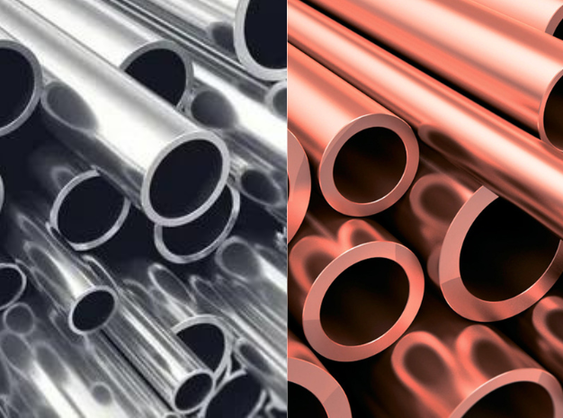
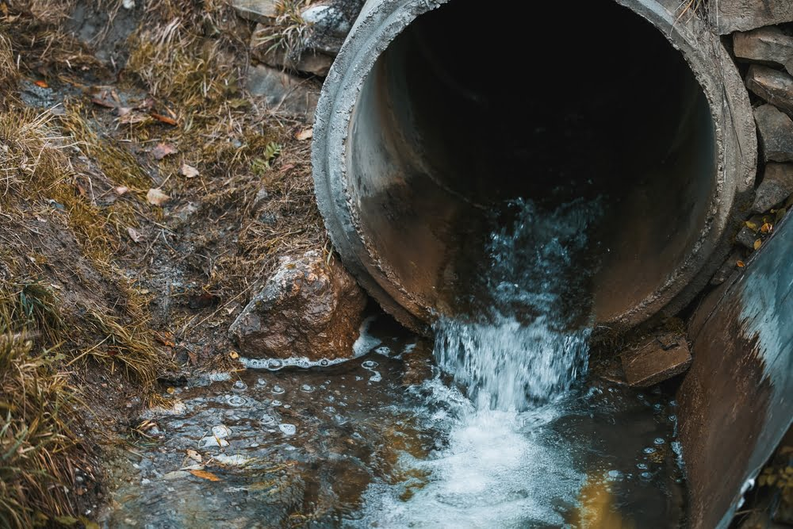
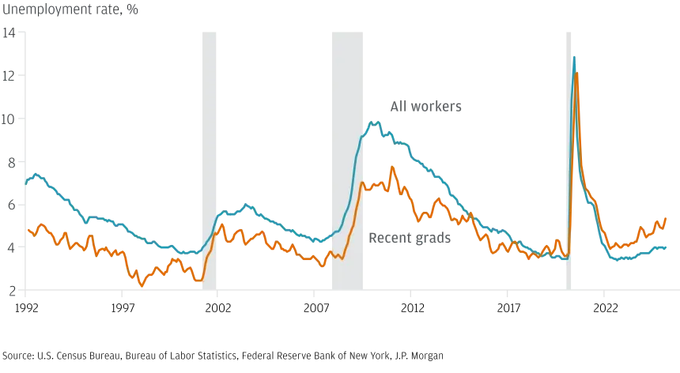
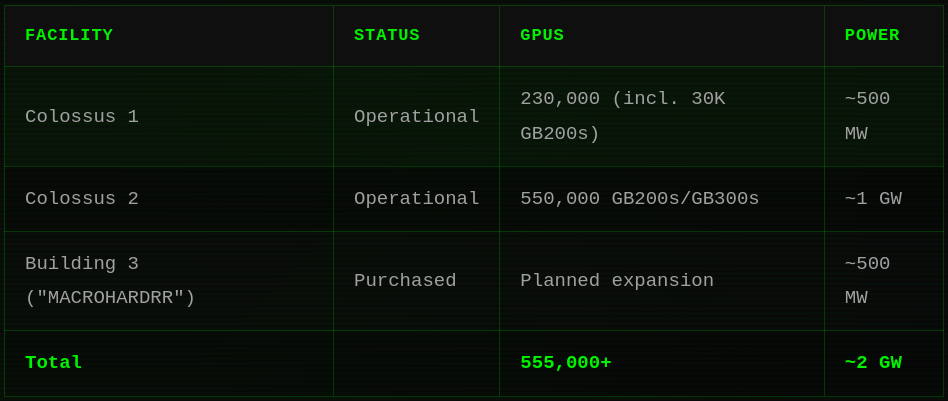
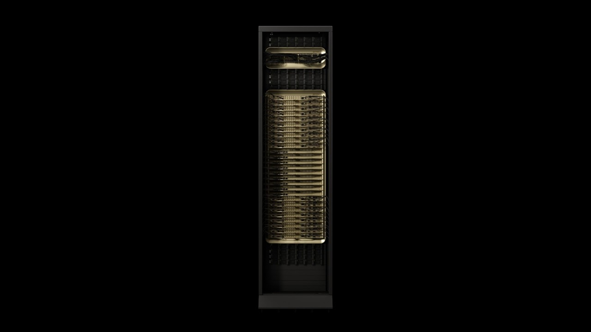
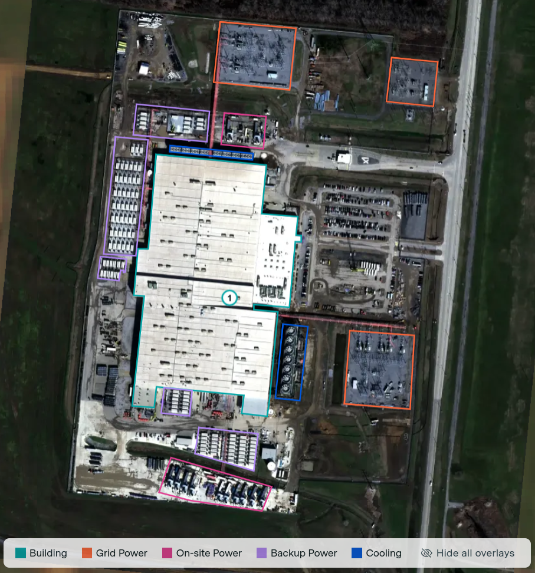
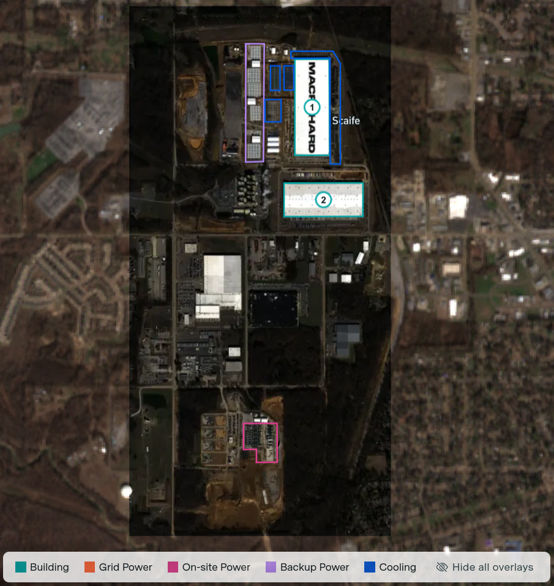
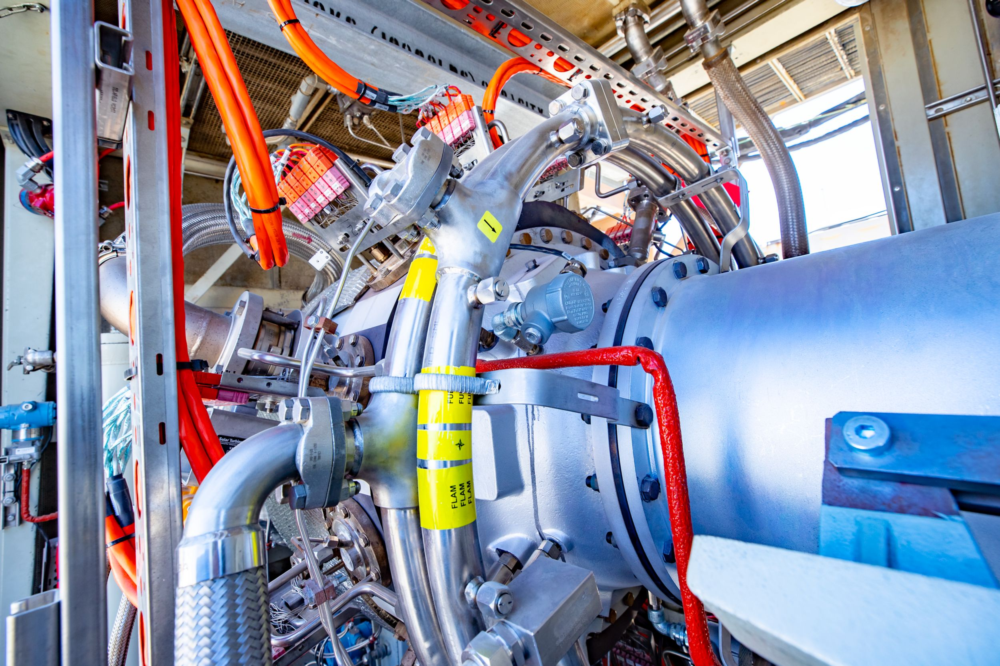
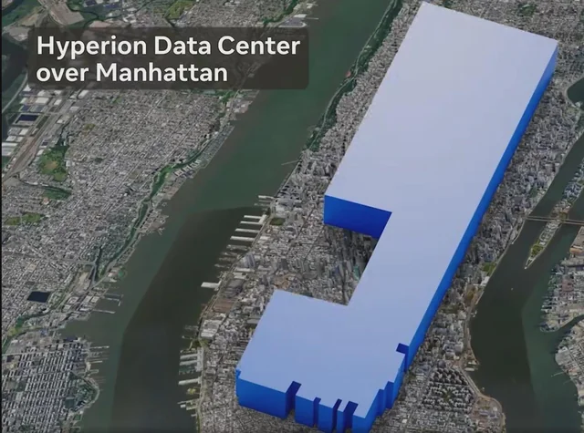

# 
 Post AI Era Datacenters Deepdive 

Papadakis Konstantinos Fotios
AEM: 10371

<!-- 
Καλησπέρα σας. 

Ονομάζομαι Παπαδάκης Κωνσταντίνος Φώτης και θα σας παρουσιάσω την πολύπλευρη ανάλυση μου πάνω στα Datacenters

- εστιάζοντας επί των πλείστων στην εποχή μετά την έκρηξη της τεχνητής νοημοσύνης.  
-->

---

## Contents <i class="fa-solid fa-list"></i>

1. [AI Boom](#ai-boom)
2. [Energy Requirements](#energy-requirements)
3. [Cooling](#cooling)
4. [Environmental Impact](#environmental-impact)
5. [Health Effects](#health-effects)
6. [Finance](#finance)
7. [Sociopolitical Aspect](#sociopolitical--aspects)
8. [Datacenter Case Study](#datacenter-case-study)

<!-- 
Οι κύριες θεματικές μας ενότητες είναι:

- οι λόγοι που γίνονται σχέδια για τεράστιες επεκτάσεις datacenter (εστιάζοντας στην Αμερική)
- οι κύριοι τρόποι κάλυψης των ενεργειακών τους αναγκών
- οι τρόποι ψύξης
- η επίδραση στο περιβάλλον
- τα προβλήματα υγείας που προκαλούν
- η οικονομική πλευρά της ιστορίας
- τα κοινωνικοπολιτικά
Και θα κλείσουμε με:
- ένα πρότζεκτ σταθμό για τα ΑΙ datacenters
- και λοιπά φιλόδοξα εγχειρήματα  
-->

---

# AI Boom <i class="fa-solid fa-bomb"></i>

What's the driving force of datacenter construction and expansions?

<!-- 
Ξεκινώντας,
Ποιοι είναι οι παράγοντες που οδηγούν στην βιασύνη υλοποίησης αυτών των έργων?
-->

---

## Artificial Intelligence <i class="fa-brands fa-openai"></i>

- Datacenters aren't new
- Many ambitious datacenter projects
- Companies are making huge investments
- Scale their Large Language model
- Win the race to AGI <i class="fa-solid fa-flag-checkered"></i>
- Technology replacing humans in most fields
- Obtain the largest possible market share

<!-- 
Τα datacenters δεν είναι καινούρια. 
Όμως πρόσφατα έχουν ανακοινωθεί πολλαπλές φιλόδοξες εγκαταστάσεις από όλες τις μεγάλες εταιρίες AI.

Αυτές οι εταιρίες ευελπιστούν πως κερδίζοντας τον ανταγωνισμό
- θα μπορέσουν να αποσπάσουν το μεγαλύτερο δυνατό ποσοστό του market που δημιουργείται 
- το οποίο εν δυνάμει μπορεί να αντικαταστήσει μεγάλο μέρος του εργατικού δυναμικού.

Μια ακόμα παράλληλη είναι η δημιουργία γενικής τεχνητής νοημοσύνης (AGI) η οποία θα άλλαζε πλήρως τα δεδομένα του εργασιακού χώρου για πάντα.
-->

---

# Energy Requirements <i class="fa-solid fa-bolt"></i>

Ways to fullfil the insatiable hunger of datacenters for electricity

<!--
Η τεράστια αυτή έκρηξη κλίμακας των datacenters σε πολύ μικρό χρονικό διάστημα απαιτεί την εύρεση ενεργειακών λύσεων που θα καλύψουν το δυσανάλογα μεγάλο φόρτο.  
-->

---

## Distributed Generation <i class="fa-solid fa-chart-pie"></i>

City main line <u>isn't enough</u>. This necessitates the use of local energy generation to meet energy demands.

### Renewable energy

- Solar panels
- Wind turbines
- Geothermal
- Nuclear

### Fossil fuels (56%)

- Coal (mainly China) [53][53]
- Diesel
- Gas
    - Field gas
    - CNG
    - LPG
    - Low BTU gases

<!--
Η γραμμή από τις κεντρικούς σταθμούς παραγωγής ηλεκτρικής ενέργειας δεν μπορούν να επωμισθούν τον φόρτο. 

Τουλάχιστον όχι μέχρι να γίνουν οι ανάλογες προετοιμασίες.

Στην αρχή το πιο εύκολο και γρήγορο είναι η παραγωγή ενέργειας on-site, δηλαδή εντός της εγκατάστασης, από ορυκτά καύσιμα.

Αυτά αποτελούν και την κύρια πηγή ενέργειας με ποσοστό 56%.

Τα πιο δημοφιλή εξ αυτών είναι:
- Οι γαιάνθρακες οι οποίοι χρησιμοποιούνται κυρίως στην Κίνα
- Το diesel
- Και μακράν το πιο δημοφιλές το αέριο. Συγκεκριμένα το CNG, αλλιώς γνωστό και ως μεθάνιο. Οι άλλες υποκατηγορίες του είναι το ακατέργαστο φυσικό αέριο, το LPG και αέρια χαμηλών BTU.

Παράλληλα υπάρχουν και οι ανανεώσιμες πηγές ενέργειας όπως:
- Ηλιακή
- Αιολική
- Πυρηνική
- Γεωθερμική
Οι οποίες προς το παρόν προέρχονται από την ανάλυση των κεντρικών μονάδων παραγωγής ηλεκτρικής ενέργειας,

αν και υπάρχουν σχέδια για 
- on-site φωτοβολταϊκά, 
- ανεμογεννήτριες κλπ. 

Η κατασκευή τους αναμένεται να δρομολογηθεί καθώς οι περισσότερες συμφωνίες αυτή τη στιγμή ειναι με κεντρικούς σταθμούς.
-->

---

## Do Datacenters fit the definition?

Distributed Generation <i class="fa-solid fa-bars"></i> On-site Generation

- Technologies being used can be considered D.E.R.(Distributed Energy Resources) 
E.g. Solar, Wind, mini gas turbines etc. 

But!
- The sheer scale of them though doesn't necessarily fit with the definition "**small**, grid-connected or distribution system-connected devices" [49][49]

<!--
Η κατανάλωση ενός μεγάλου datacenter αυτή τη στιγμή βρίσκεται κοντά στα 2 GW.
Έτσι εύλογα γεννιέται η απορία: 

- Μπορεί να ονομαστεί η παραγωγή που επιτελείται στις εγκαταστάσεις τους διανεμημένη?

Οι μορφές ενέργειας που καλύπτουν και θα καλύψουν τις ανάγκες τους μπορούν να χαρακτηριστούν διανεμημένες πηγές ενέργειας (πχ φωτοβολταϊκά, μικροί αεριοστρόβιλοι) 

αλλά η κλίμακα αυτών είναι απαγορευτική για να μπορέσουν να ικανοποιήσουν την προϋπόθεση να είναι μικρές 

καθώς επίσης δεν είναι απαραίτητα συνδεδεμένες με το grid.

Προς το παρόν οι διάφορες μονάδες παραγωγής ηλεκτρική ενέργειας on-site λειτουργούν μόνο για την κάλυψη των ενεργειακών αναγκών των εγκαταστάσεων, και δεν δίνουν τίποτα πίσω στο δίκτυο.
-->

---

## Scale close or exceeding centralized

### Examples
Descending Capacity Order

| Name | Capacity(MW) |
|------|--------------|
|Sabine River Works | 2,124.0 |
|Forney Energy Center| 1,784.0 |
|Midlothian | 1,734.0 |
|Temple 1&2 | 1,500.0 |

<!--
Χαρακτηριστικά μπορούμε να δούμε τις κεντρικές μονάδες παραγωγής ηλεκτρικής ενέργειας στο Texas, όπου βρίσκεται μεγάλο μέρος των datacenter.

Το μέγιστο capacity σταθμού φτάνει μέχρι περίπου τα 2 GW.

Δηλαδή ίδια τάξη κλίμακας με τα datacenters. 
-->

---

## Fossil fuel candidates <i class="fa-solid fa-oil-well"></i>

Generators can be powered by:

- **Diesel**
- **Field gas**: Gas extracted from a production well before it enters a natural gas processing plant [31][31].
- **CNG**: <mark>Compressed Natural Gas</mark>, mainly methane compressed at a pressure of 200 to 248 bars [32][32].
- **LPG**: <mark>Liquefied Petroleum Gas</mark>, a mixture of propane and butane liquefied at 15 °C and a pressure of 1.7-7.5 bars [32][32].
- **LowBTU gases**: Natural gas, which at the wellhead has a gross heating value $\le 450$ BTU. Part of petroleum refining and crude oil, natural gas production.

<!--
Εξειδικεύοντας στα ορυκτά καύσιμα βλέπουμε ότι:
- Το field gas είναι το φυσικό αέριο πριν επεξεργαστεί
- Το CNG είναι κατά βάση μεθάνιο συμπιεσμένο σε πιέσεις της τάξης των 100 με 248 bars
- Το LPG είναι μια μίξη απο προπάνιο και βουτάνιο υγροποιημένα στους 15 °C σε συνθήκες πίεσης 1.7 με 7.5 bars
- Και τέλος τα αέρια χαμηλής θερμογόνου δύναμης αποτελούν παραπροϊόν διύλισης υδρογονανθράκων(πετρέλαιο και αργό πετρέλαιο) 
-->

---

## Fuel Comparison <i class="fa-solid fa-square-poll-horizontal"></i>

| Comparison | CNG | LPG |
| ---------- | --- | --- |
| Constituents | Methane | Propane, Butane|
| Energy density | Lower caloric value | Higher caloric value |
| Cost | Cheaper | More expensive |
| Emissions| Less than LPG | Less than gasoline |
| Safety | Disperses quickly | Settles to ground, and highly inflammable |

CNG risk of ignition is significantly lower since LPG is both highly inflammable and settles to ground.

<!--
Σε μια σύγκριση των δύο πιο διαδεδομένων εναλλακτικών:
- Το CNG έχει χαμηλότερη θερμιδική αξία από το LPG όμως
- Είναι φθηνότερο  
- Παράγει λιγότερους ρύπους
- Και διαχέεται στο χώρο σε περίπτωση ατυχήματος κάνοντας το πιο δύσκολο να αναφλεχθεί συγκριτικά με το LPG το οποίο είναι ιδιαίτερα εύφλεκτο και παραμένει στο έδαφος. 
-->

---

# Cooling <i class="fa-solid fa-snowflake"></i>

Bringing down the temperature to avoid thermal throttling

<!--
Τώρα θα ασχοληθούμε με τις τεχνολογίες ψύξης που μας επιτρέπουν να διατηρήσουμε την απόδοση υψηλή 

αποτρέποντας το υλισμικό μας από το να υπερβεί τις θερμοκρασίες λειτουργίας του. 
-->
---

## Water <i class="fa-solid fa-droplet"></i> vs Air <i class="fa-solid fa-fan"></i>

Water is chosen because it is more thermally conductive than air
- Air: 0.026 \[W/mK\]
- Water: 0.6089 \[W/mK\] [37][37]

Thus the more energy efficient solution depend on a more and more direct heat dissipation from water or even special non-conductive liquids. 

<!--
Μια βασική ερώτηση είναι ποιο μέσο απομακρύνει ευκολότερα τη θερμότητα
- Το νερό 
- Ή ο αέρας
Κρίνοντας από της τιμές θερμαγωγιμότητας βλέπουμε ότι το νερό είναι τουλάχιστον μια τάξη μεγέθους μεγαλύτερο και άρα καλύτερο.

Όμως τι είναι θερμαγωγιμότητα στα μαθηματικά?
-->

---

## Thermal conductivity <i class="fa-solid fa-temperature-high"></i>

The thermal conductivity of a material is a measure of its ability to conduct heat. It quantifies the proportionality between the heat flux $q$ and the temperature gradient $\nabla T$ in the direction of heat transport.

$$ -k =  \frac{q}{\nabla T} \ [W/mK]$$

- $q \ [W/m^2]$: heat flow rate per unit area
- $\nabla T \ [K/m]$: temperature gradient in the direction of heat transport

<!--
Η θερμαγωγιμότητα είναι η ικανότητα ενός υλικού να άγει θερμότητα. Μαθηματικά ορίζεται ως:
- την αναλογία της ροής θερμότητας ανά μονάδα επιφάνειας 
- δια το gradient της θερμοκρασίας κατά τη φορά μετάδοσης της θερμότητας
-->

---

### Copper vs Aluminum <i class="fa-solid fa-weight-hanging"></i>

- Copper piping
- ✅ Great thermal conductivity[33][33]
    - Copper: $401 \ [W/mK]$
    - Aluminum: $205 \ [W/mK]$

- ❌ More expensive per tonne[34][34]
    - Copper: $12808\$/t$
    - Aluminum: $3385\$/t$

<!--
Στη συνέχεια αφού έχουμε διαπιστώσει ότι το νερό είναι προτιμότερο σε απαιτητικές εφαρμογές...

Ποιο υλικό θέλουμε να είναι σε επαφή με τα τις CPU, GPU, Μνήμες κλπ?

Ο χαλκός ή το αλουμίνιο?
Από πλευράς απόδοσης η θερμαγωγιμότητα του χαλκού είναι διπλάσια και για αυτό επιλέγεται.
Αν υπάρχει και ο παράγοντας του κόστους, η τωρινές τιμές της αγοράς για τα δύο υλικά τοποθετούν τον χαλκό σε 4-πλάσια τιμή σε σχέση με το αλουμίνιο. Οπότε οικονομικά συμφέρει περισσότερο το αλουμίνιο.
-->

---

### Galvanic Corrosion <i class="fa-solid fa-triangle-exclamation"></i>

Galvanic is an electrochemical process that occurs when two metals with different electrochemical activity are in contact with each other (like copper and aluminum). 

<!--
Προσοχή όμως στην μίξη των δύο καθώς υπάρχει ο κίνδυνος της γαλβανικής διάβρωσης η οποία οφείλεται στη διαφορετική ηλεκτροχημική δραστηριότητα των δύο μετάλλων.
-->

---

### Galvanic Corrosion <i class="fa-solid fa-triangle-exclamation"></i>

The more noble, passive metal (copper or nickel) drives the corrosion of the active, less noble metal (aluminum), where the passive metal remains fairly unharmed. [33][33]

<!--
Το πιο ευγενές δηλαδή αδρανές μέταλλο (δηλαδή ο Χαλκός) ωθεί το πιο δραστήριο (δηλαδή το Αλουμίνιο) να διαβρωθεί. 

Δίπλα παρατηρούμε πως μοιάζει η διάβρωση πάνω στον εξοπλισμό.
-->

---

## Cooling types <i class="fa-solid fa-snowflake"></i>

1. Computer Room Air Conditioning
2. Evaporative Cooling
3. Direct-To-Chip Cooling
4. Single-Phase Immersion Cooling
5. Multi-Phase Immersion Cooling [38][38]

<!-- 
Εν τέλει, καταλήγουμε σε 5 βασικούς τύπους ψύξης στα datacenters
- Την CRAC που χρησιμοποιεί μονάδες air conditioning
- Την Ψύξη μέσω εξάτμισης
- Την Άμεση ψύξη κατευθείαν στο τσιπ
- Την Ψύξη βύθισης μίας φάσης 
- Και την ψύξη βύθισης πολλαπλών φάσεων
-->

---

## Computer Room Air Conditioning (CRAC)

The origin of datacenter cooling. Rooms dedicated to housing IT equipped with traditional home use A.C. units.

| Metrics | Rating |
|-|-|
| Energy Efficiency <i class="fa-solid fa-bolt"></i> | 1/5 🟥 |
| Sustainability <i class="fa-solid fa-leaf"></i> | 1/5 🟥 |
| Initial Investment <i class="fa-solid fa-money-bill"></i> | 4/5 🟨|

13KW CRAC

<!--
Η πρώτη μέθοδος αποτελεί και την πρώτη που εφαρμόστηκε στα νηπιακά datacenters πολύ μικρότερης κλίμακας.

Χρησιμοποιεί κλιματιστικά τα οποία
- αρχικά ήταν απλά σπιτιού και
- έπειτα κατασκευάστηκαν και πιο ισχυρά για πιο απαιτητικές χρήσεις

Έχουν:
- Κακή απόδοση
- Δεν είναι βιώσιμα επειδή χρησιμοποιούν τόση ενέργεια
- Όμως δεν απαιτούν μεγάλη αρχική επένδυση 

Στη φωτογραφία βλέπουμε ένα 13 kW CRAC της Coolnet.
-->

---

## Evaporative Cooling <i class="fa-solid fa-snowflake"></i>

Dissipates heat by converting liquid water into vapor, absorbing heat during the evaporation process.

2 ways:
- **Direct** evaporative cooling, where server room air passes through a water-soaked membrane
- **Indirect** evaporative cooling, which uses heat exchangers to cool air before pumping it into server rooms

| Metrics | Rating |
|-|-|
| Energy Efficiency <i class="fa-solid fa-bolt"></i> | 5/5 🟩 |
| Sustainability <i class="fa-solid fa-leaf"></i> | 2/5 🟧 |
| Initial Investment <i class="fa-solid fa-money-bill"></i> | 5/5 🟩 |

<!--
Η μέθοδος της εξάτμισης από την άλλη πλευρά απομακρύνει την θερμότητα μετατρέποντας νερό σε ατμό.

Είναι η κύρια μέθοδος ψύξης στα datacenters επειδή:
- Είναι πολύ ενεργειακά αποδοτικό και 
- χρειάζεται ελάχιστη αρχική επένδυση 
- όμως δεν είναι βιώσιμο καθώς χρησιμοποιεί μεγάλες ποσότητες νερού αφαιρώντας τις από τα οικοσυστήματα και τον άνθρωπο

Υπάρχουν δύο υποκατηγορίες αυτής.
- Η άμεση: στην οποία ο αέρας που εισέρχεται στα δωμάτια των server περνάει πρώτα από μια νοτισμένη μεμβράνη
- Και η έμμεση η οποία χρησιμοποιεί εναλλάκτες θερμότητας για να κρυώσουν τον αέρα που εισέρχεται στα δωμάτια των server
-->

---

## Direct

The humidifier adds water to the incoming air stream:
- raising its humidity 
- reducing its temperature [50][50]

This conditioned air is then simply supplied to the room with a high percentage of the room air being exhausted rather than re-circulated to maintain a low humidity in the room.

<!--
Στην άμεση ο υγραντήρας προσθέτει νερό στον αέρα 
- ανεβάζοντας την υγρασία του και 
- ρίχνοντας την θερμοκρασία του
Ο περισσότερος αέρας απομακρύνεται και δεν παραμένει στο δωμάτιο για να κρατηθεί χαμηλή η υγρασία
-->

---

## Indirect

Cool outside air is drawn through a heat recovery unit then immediately exhausted. Meanwhile internal air is drawn from the room and circulated through the heat recovery unit before being re-introduced to the room. The outside air’s cool thermal energy is thus transferred to the internal air via the heat recovery unit without the two streams directly mixing
[50][50]

<!--
Στην έμμεση από την άλλη ο εξωτερικός αέρας περνάει από την μονάδα ανάκτησης θερμότητας και απευθείας απομακρύνεται. 
Ο εσωτερικός αέρας από την άλλη, περνάει και αυτός από την μονάδα ανάκτησης θερμότητας και διοχετεύεται εκ νέου στο δωμάτιο.

Έτσι στην ουσία μεταφέρουμε την θερμότητα απο το δωμάτιο στο περιβάλλον χωρίς να αναμιγνύουμε τον μέσα και έξω αέρα.

Πολλές φορές αυτό δεν το θέλουμε λόγω:
- της κακής εξωτερικής ποιότητας αέρα 
- και επειδή μπορεί η εγκατάστασή μας να λειτουργεί σε συνθήκες απουσίας σωματιδίων.  
-->

---

## Direct-To-Chip Cooling

D2C systems circulate chilled liquid through pipes near heat-generating components, such as CPUs and GPUs, cooling only areas that require it.

| Metrics | Rating |
|-|-|
| Energy Efficiency <i class="fa-solid fa-bolt"></i> | 5/5 🟩 |
| Sustainability <i class="fa-solid fa-leaf"></i> | 5/5 🟩 |
| Initial Investment <i class="fa-solid fa-money-bill"></i> | 2/5 🟧 |

Prone to system disruption (coolant leakage)

<!--
Τα συστήματα άμεσης ψύξης κατευθείαν στο τσιπ (ή D2C) μεταφέρουν ψυκτικό υγρό κατευθείαν στα στοιχεία του server. 
Έτσι είναι:
- πολύ ενεργειακά αποδοτικά
- λειτουργούν σε κλειστό κύκλο και άρα δεν αποσπούν νερό από οικοσυστήματα (τις περισσοτερες φορές δεν είναι καν νερό αλλά κάποιο ψυκτικό υγρό)
- όμως η αρχική επένδυση είναι αρκετά μεγάλη
-->

---

## Close up Look

1 MW of server equipment costs 
$\quad\quad\quad\quad\quad$<i class="fa-solid fa-down-long"></i>

approximately 650,000$

<!--
Εδώ βλέπουμε από κοντά ένα τέτοιο σύστημα εντός server rack
- Από τον ένα σωλήνα εισέρχεται το ψυκτικό υγρό 
- Από τον άλλον εξέρχεται 
- Στο μεταξύ περνάει από τα στοιχεία του server που χρειάζονται ψύξη
(CPU RAM ROM etc)

Για 1 MW server εξοπλισμό πρέπει να δαπανήσουμε περίπου 650,000 $ για την ψύξη του με D2C (direct to chip cooling)
-->

---

## Single-Phase Immersion Cooling <i class="fa-solid fa-snowflake"></i>

Submerges IT equipment directly in non-conductive liquid that efficiently absorbs and dissipates heat. The leakage risk is lower than D2C cooling.

| Metrics | Rating |
|-|-|
| Energy Efficiency <i class="fa-solid fa-bolt"></i> | 5/5 🟩 |
| Sustainability <i class="fa-solid fa-leaf"></i> | 5/5 🟩 |
| Initial Investment <i class="fa-solid fa-money-bill"></i> | 1/5 🟥 |

1 MW of server equipment costs approximately 1 million $

<!--
Η ψύξη βύθισης μίας φάσης βυθίζει τον εξοπλισμό μας σε κάποιο μη αγώγιμο υγρό για να απομακρύνει την θερμότητα.

Είναι
- Πολύ ενεργειακά αποδοτικό
- Βιώσιμο
- Όμως το αρχικό του κόστος είναι απαγορευτικό για τις περισσότερες εγκαταστάσεις

Σε περίπτωση διαρροής το πρόβλημα επιλύεται πιο εύκολα σε σχέση με D2C.
-->

---

## Multi-Phase Immersion Cooling <i class="fa-solid fa-snowflake"></i>

Improves on the previous method by replacing the liquid with a non-conductive liquid that boils when exposed to the equipment's heat. As the liquid evaporates, it efficiently removes heat, making it one of the fastest and most effective, most expensive  cooling solutions available.

| Metrics | Rating |
|-|-|
| Energy Efficiency <i class="fa-solid fa-bolt"></i> | **6/5** 🟩 |
| Sustainability <i class="fa-solid fa-leaf"></i> | 5/5 🟩 |
| Initial Investment <i class="fa-solid fa-money-bill"></i> | **0/5** 🟥 |

<!--
Τέλος στη ψύξη βύθισης πολλαπλών φάσεων το υγρό αλλάζει φάση, από υγρό σε αέριο, και απομακρύνει την θερμότητα ακόμα πιο γρήγορα

Ειναι:
- Εξαιρετικά ενεργειακά αποδοτικό
- Βιώσιμο
- Όμως η αρχική επένδυση είναι πιο απαγορευτική ακόμα και από την προηγούμενη υλοποίηση
-->

---

# Environmental Impact <i class="fa-solid fa-leaf"></i>

The disruption of nature's equilibrium

<!--
Η επόμενη συζήτηση περιστρέφεται γύρω από τις περιβαλλοντικές συνέπειες των datacenters. 
-->

---

## Emissions <i class="fa-solid fa-smog"></i>

Diesel generators and Gas Turbines emit:

- Nitrogen oxides ($NO_x$)
- Carbon dioxide ($CO_2$)
- Carbon monoxide ($CO$)
- Sulfur oxides ($SO_x$)
- Unburned Hydrocarbons
- Smoke [51][51]

### Causing:
- Health problems
- Acid rain
- Climate change

<!--
Η λειτουργία σταθμών Diesel και Αεριοστρόβιλικών σταθμών εκλύει τους εξής ρύπους στην ατμόσφαιρα:
- Οξείδια του αζώτου
- Διοξείδιο του άνθρακα
- Μονοξείδιο του Άνθρακα
- Οξείδια του θείου
- Άκαυστους Υδρογονάνθρακες και
- Καπνό

Τα οποία προκαλούν:
- Προβλήματα υγείας που θα δούμε παρακάτω...
- Όξινη βροχή και
- Κλιματική αλλαγή
-->

---

## Water Shortage <i class="fa-solid fa-droplet"></i>

Most servers follow the <mark>Evaporative Cooling</mark> route because it has great energy efficiency while being cost effective. This means:
- Most of the water turns into steam 
- Then released into the atmosphere
- And taken out of immediate human usage

Leading to reduced availability for agriculture, drinking, and ecosystems.

<!--
Η ευρεία χρήση των συστημάτων ψύξης με εξάτμιση συνεπάγεται:
- Μετατροπή του μεγαλύτερου ποσοστού του νερού που χρησιμοποιείται για ψύξη σε ατμό
- Έκλυση αυτού στο περιβάλλον ( αν και ορισμένες εγκαταστάσεις εξετάζουν το ενδεχόμενο ανακύκλωσης του νερού ) 
- Αφαίρεση από άμεση ανθρώπινη χρήση

Συνεπώς μειώνεται η ποσότητα 
- Πόσιμου νερού
- Του νερού που μπορεί να διατεθεί στην γεωπονία, 
- στους ανθρώπους για οικιακή κατανάλωση
- Και στα ποικίλα οικοσυστήματα
-->

---

## Chemical Runoff <i class="fa-solid fa-skull-crossbones"></i>

During the evaporative cooling process, chemicals can mix with the water. These chemicals may then escape the system, often as part of excess liquid that is drained from the cooling systems after evaporation.

- **Biocides**: Chemicals designed to prevent the growth of bacteria, mold, and algae. Contains isothiazolinones, glutaraldehyde, etc.
- **Corrosion Inhibitors**: Chemicals that prevent corrosion within cooling systems. Includes phosphates, molybdates, etc. which contribute to eutrophication disturbing marine ecosystems.  
- **Heavy Metals**: Chemicals originating from the cooling systems' materials. Include zinc, copper, chromium. [63][63], [64][64]

<!--
Από τα ίδια συστήματα ψύξης σύνηθες φαινόμενο είναι και ρίψη χημικών αποβλήτων στην πηγή από την οποία αντλούν το νερό. Αυτό γίνεται μέσω σωλήνων οι οποίοι απομακρύνουν το θερμό νερό από την εγκατάσταση.

Το νερό αυτό περιέχει:
- Βιοκτόνα, δηλαδή χημικά που αποτρέπουν την ανάπτυξη μικροβίων μούχλας και άλγης
- Αναστολείς διάβρωσης, δηλαδή χημικά που αποτρέπουν την διάβρωση των συστημάτων ψύξης
- Και βαρέα μέταλλα, τα οποία προέρχονται απευθείας από τα μέταλλα που απαρτίζουν τα συτήματα ψύξης (Χαλκό, Ψευδάργυρο, Χρώμιο)
-->

---

## Eutrophication <i class="fa-solid fa-carrot"></i>

An increased load of nutrients ending up at estuaries and coastal waters leading to a cycle of:

- Algae growth blocks sunlight
- Plants die
- Algae dies
- Bacteria digest dead plants using up oxygen and producing $CO_2$
- If fish can't swim away they become diseased or die without oxygen. [65][65]

<video width="550" src="media/eutrophication.mp4" controls></video>

<!--
Οι αναστολείς διάβρωσης συγκεκριμένα αποτελούν θρεπτικά συστατικά χρήσιμα για την θαλάσσια ζωή. Η αποβολή αυτών, καταλήγοντας σε εκβολές ποταμών και παράκτια ύδατα, οδηγεί στον ευτροφισμό ο οποίος πυροδοτεί τον εξής φαύλο κύκλο:

(Προτιμάτε να δούμε το βίντεο του ενός λεπτού?)

1. Η άλγη θρέφεται
2. Μεγαλώνει και μπλοκάρει τον ήλιο απο το να διεισδύσει στη θάλασσα
3. Τα φυτά πεθαίνουν  
4. Η αλγη πεθαίνει και αυτή
5. Βακτήρια καταναλώνουν νεκρά φυτά χρησιμοποιώντας οξυγόνο και παράγοντας διοξείδιο του άνθρακα
6. Αν τα ψάρια δεν μπορούν να απομακρυνθούν εγκαίρως πεθαίνουν και αυτά από έλλειψη οξυγόνου
-->

---

# Health Effects <i class="fa-solid fa-heart-pulse"></i>

The risks datacenters pose to the public's well being

<!--
Καιρός να μιλήσουμε και για τις επιπτώσεις των datacenters στη υγεία του ανθρώπου.
-->

---

## NOx - Nitrogen Oxides <i class="fa-solid fa-cloud"></i>

Methane gas turbines pump harmful nitrogen oxides (mainly $NO_2$) into the air, which are known to cause:

- Lung irritation 
- Breathing difficulties
- Asthma
- Respiratory diseases 
- Cancer [4][4], [26][26], [6][6]

Children are especially susceptible to respiratory conditions. 

<!--
Τα οξείδια του αζώτου που εκλύουν οι αεριοστρόβιλοι είναι γνωστό ότι προκαλούν:
- Ερεθισμό του αναπνευστικού
- Δύσπνοια
- Άσθμα
- Παθήσεις του αναπνευστικού 
- Και καρκίνο

Με τα παιδιά να είναι ιδιαίτερα ευάλωτα σε αναπνευστικά προβλήματα (ιδίως παιδικό άσθμα )
-->

---

## Chemical Runoff <i class="fa-solid fa-flask-vial"></i>

- **Biocides**: Can cause <mark>allergies</mark> and <mark>skin irritation</mark>.
- **Heavy Metals**: Are <mark>carcinogenic</mark> and can <mark>harm the skin, respiratory system, and kidneys</mark>. [64][64]

<!--
Από τα χημικά απόβλητα:
- Τα βιοκτόνα προκαλούν αλλεργίες και ερεθισμό του δέρματος
- Ενώ τα βαρέα μέταλλα είναι καρκινογόνα και προκαλούν προβλήματα στο αναπνευστικό και στα στα νεφρά
-->

---

## Sustained audible noise pollution <i class="fa-solid fa-ear-listen"></i>

Constant sound exposure is associated with:
- Annoyance
- Disrupted sleep cycles
- Cardiovascular disorders
- Impaired cognitive development of children
- Worsened psychological and physical well-being [35][35]
- Seizures (audiogenic epilepsy) [36][36]

<!--
Κατά την λειτουργία τους τα datacenters παράγουν παρατεταμένη ηχορύπανση στο φάσμα του ήχου που ακούν και δεν ακούν οι άνθρωποι.

Ξεκινώντας με το φάσμα που ακούν, τους προκαλεί:
- Ενόχληση
- Διατάραξη ύπνου
- Καρδιαγγειακές παθήσεις
- Διατάραξη της γνωστικής ανάπτυξης των παιδιών
- Χειροτέρευση της ψυχολογικής και σωματικής ευημερίας
- Επιληπτικά επεισόδια
-->

---

## Infrasound <i class="fa-solid fa-wave-square"></i>

Infrasound is low frequency sound  below the lower limit of human hearing (around 20Hz)  [1][1]

🟨: loud, Y-axis: frequencies, X-axis: time

### Known Health Effects [13][13]

- Spike in cortisol levels (stress, hyppertension) [14][14], [15][15]
- Nausea, Dizziness[12][12]
- Vibroacoustic disease [16][16]
- High frequency hearing loss [17][17]
- Shortness of breath [18][18]
- Anxiety, Depression [19][19]

<!--
Κάτω από τα 20 Hz βρίσκεται το φάσμα των ήχων που δεν γίνονται αντιληπτοί από την ανθρώπινη ακοή.

Για παράδειγμα στο παρακάτω σχήμα βλέπουμε ότι κάτω από την μωβ γραμμή (δηλαδή τα 20 Hz) έχουμε αυξημένη ένταση ήχου που φαίνεται με έντονο κίτρινο χρώμα.

Στο συγκεκριμένο φαινόμενο δεν μπορούμε ενστικτωδώς να αποδώσουμε κάποια συνέπεια επειδή άλλωστε δεν ακούμε τον ήχο αυτό οπότε δεν βγάζει απαραίτητα νόημα να μπορεί να μας επηρεάσει.

Όμως πολλαπλές έρευνες αποτυπώνουν ότι οι υπόηχοι προκαλούν:
- Αυξηση της κορτιζόλης (δηλαδή του στρες και της υπέρτασης)
- Ναυτία και ζάλη
- Vibroacoustic disease 
- Χάσιμο ακοής υψηλής συχνότητας
- Δύσπνοια
- Κρίσεις άγχους και κατάθλιψη
-->

---

# Finance <i class="fa-solid fa-money-bill"></i>

The economic side of the story

<!--
Στη συνέχεια στα Οικονομικά...
-->

---

## Maximized Demand <i class="fa-solid fa-hand-holding-hand"></i>

In the process of building these Datacenters, companies are:

- Placing open-ended orders for memory effectively <i class="fa-solid fa-right-long"></i>
- Telling manufacturers they will buy as much as can be delivered, regardless of the price

Manufacturers are in return:

- Pivoting their factories away from making standard consumer memory to <i class="fa-solid fa-right-long"></i>
- Prioritize high-profit enterprise chips ( This affects both **RAM** and **Hard Disks**)

The AI build-out is colliding with a supply chain that cannot meet its physical requirements. [46][46], [47][47]

<!--
Για την κατασκευή των Datacenters οι εταιρίες:
- εκφέρουν ανοικτά παραγγελίες για μνήμη 
- ουσιαστικά εννοώντας ότι θα αγοράσουν όση μνήμη οι κατασκευαστικές εταιρίες μπορούν να προσφέρουν σε οποιαδήποτε τιμή

Αυτό έχει ως συνέπεια οι κατασκευαστές να:
- Προτεραιοποιούν την παραγωγή μνημών για τους παραγωγούς datacenter οι οποίοι τους προσφέρουν υψηλά ποσοστά κέρδους
- Και έτσι ανεβαίνουν υπερβολικά πολύ οι τιμές για τους κανονικούς καταναλωτές

Όπως έχει ειπωθεί πολύ εύστοχα:

"Η κατασκευή των υποδομών για το AI έρχεται σε σύγκρουση με την εφοδιαστική αλυσίδα η οποία δεν μπορεί να ανταπεξέλθει στις απαιτήσεις της"
-->

---

# Sociopolitical $\quad$ Aspects <i class="fa-solid fa-scale-balanced"></i>

The effects that reverberate throughout the 

<!--
Πως έχουν αντηχήσει τα datacenters τον κοινωνικοπολιτικό ιστό?  
-->

---

## Job Creation <i class="fa-solid fa-briefcase"></i>

Stargate

- **100,000–200,000** construction and operations jobs [9][9]
- **~25,000** onsite jobs [11][11]
- Large automated data centers often need *only dozens* of permanent staff once built
- May only employ **~57** ongoing workers, despite promises of thousands [12][12]

<!--
Στο κομμάτι της ανεργίας τα Datacenters:
- Υπόσχονται εκατοντάδες χιλιάδες θέσεις εργασίας
- Και δεκάδες χιλιάδες μόλις τελειώσει η κατασκευή των έργων

Όμως οι ειδικοί προειδοποιούν πως
- Μόλις φτιαχτεί ένα τέτοιο έργο το ανθρώπινο δυναμικό απαραίτητο για την εύρυθμη λειτουργία του είναι ελάχιστο 
- Σε ένα ακραίο παράδειγμα μπορεί να απασχολεί μόλις 57 άτομα.
-->

---

## Post AI World jobs <i class="fa-solid fa-robot"></i>

Many companies announce layoffs to cut costs tends to show that AI is a revolution like no other, one that doesn't create more jobs than it replaced. The paper with the predictions

<!--
Παράλληλα πολλές εταιρίες πληροφορικής ανακοινώνουν κύματα απολύσεων η μια μετά την άλλη δημιουργώντας το ερώτημα στον κόσμο:

Είναι η επανάσταση του AI μια τεχνολογική επανάσταση που δεν γεννάει τόσες δουλειές όσες αντικαθιστά?
-->

---

## AI Occupational Exposure <i class="fa-solid fa-robot"></i>

Tasks which are heavily reliant on the standardized <mark>processing of textual information</mark>, are things AI is likely to be good at. [48][48]

Tasks, which rely on in-person <mark>physical dexterity</mark>, are naturally less exposed to AI. (recent advancements in robotics question this) 

<!--
Στο συγκεκριμένο paper ερευνάται αυτό ακριβώς. 

Οι συγγραφείς διαχωρίζουν τις δουλειές σε δυο κατηγορίες:
- Αυτές που απαιτούν την επεξεργασία πληροφοριών εντός context στις οποίες είναι καλό το AI
- Και σε αυτές που απαιτούν υψηλή σωματική επιδεξιότητα και το AI δυσκολεύεται να τις αντικαταστήσει.

Αν και αυτό είναι αμφιλεγόμενο...
-->

---

## Advancements in Robotics <i class="fa-solid fa-robot"></i>

\
<video width="550" src="media/china-robots-spring-festival.mp4" controls></video>

### 
 China CGTN 2026 

On China's Spring festival (Chinese New Year) we witnessed some impeccable AI augmented robot dexterity live on China Global Television Network.

Growth is rapid and real life applications are imminent.

<!--
Εδώ μπορούμε να δούμε ένα σύντομο απόσπασμα από το ανοιξιάτικο φεστιβάλ της Κίνας.

(Βίντεο 3.00-3.22)

Η ικανή βελτίωση των ρομπότ είναι αναπόφευκτη όμως ίσως όχι οικονομικά βιώσιμη τον πρώτο καιρό.
-->

---

## Unemployment

**5** equally sized groups based on their AIOE score, with quintile **1** being the <mark>least AI-exposed</mark> and quintile **5** being the <mark>most AI-exposed</mark>

More unemployment for the least exposure workers. [48][48]

<!--
Συνεχίζοντας με την έρευνα χωρίζουμε τους ανθρώπους σε 5 κατηγορίες 
- με 1 να είναι οι λιγότερο επηρεασμένοι από το AI
- και 5 να είναι οι περισσότερο επηρεασμένοι από το AI

Τα δεδομένα δεν επιβεβαιώνουν οποιαδήποτε ανεργία από το AI και αντιθέτως φαίνεται οι λιγότερο επηρεασμένοι να σημειώνουν υψηλότερα ποσοστά ανεργίας.
-->

---

## Opposite point of view <i class="fa-solid fa-user-tie"></i>

Compared to previous technological revolutions, experts say AI is chipping away at many white-collar jobs, including coding and marketing roles, and allowing companies to reduce hiring and improve productivity with fewer workers. [54][54]

<!--
Η αντίθετη πλευρά ισχυρίζεται ότι πρόκειται να μειωθούν οι "White Collar" δουλειές επιτρέποντας τις εταιρίες να ελαχιστοποιήσουν τα κόστη τους ενώ διατηρούν υψηλά την αποδοτικότητά τους

Ο όρος "White Collar" προέρχεται από την σύνηθη ενδυμασία των ανθρώπων σε δουλειά γραφείου.
-->

---

## J.P. Morgan study

- Graduate students face a tougher job market

- In affected professions experience is appreciated [55][55]

<!--
Μια ακόμη έρευνα πάνω στο θέμα προβάλλει τους αποφοίτους να έχουν μεγαλύτερο ποσοστό ανεργίας από το συλλογικό εργατικό δυναμικό, για πρώτη φορά στη σύγχρονη ιστορία 
-->

---

## Backlash <i class="fa-solid fa-bullhorn"></i>    

$\text{``Monterey park protest"}$

Across the nation many revolts against datacenters are occuring.

More than 50 active groups across 17 states targeted 30 projects during that time period, two-thirds of which were halted. [7][7]

<!--
Καθ'όλη την Αμερική παρατηρούνται πολλές πορείες που τοποθετούνται κατά της κατασκευής datacenters κοντά στην περιοχή τους.

Ως αποτέλεσμα παραπάνω τα 2/3 των στοχευμένων 30 πρότζεκτ έχουν σταματήσει.
-->

---

## Ownership <i class="fa-regular fa-face-laugh"></i>

Shift towards cloud computing

- Less burden on the user's device <i class="fa-solid fa-laptop"></i>
- Can sell less powerful devices, useless without cloud computing assistance [40][40]
- Cloud storage, cloud gaming [43][43], cloud movies [41][41], cloud music [42][42], cloud AI, cloud everything <i class="fa-solid fa-cloud"></i>

Cloud services instigate subscription based models which degrade ownership.

<!--
Χρονικά ταυτιζόμαστε και με μια συστημική προσπάθεια να εξαλειφθεί η έννοια της ιδιωτικής περιουσίας προκειμένου να μεγιστοποιηθεί το κέρδος των εταιριών.

Η γενική μας στροφή προς τις υποδομές νέφους, μια εκ των οποίων είναι και το AI οδηγεί σε:
- Συνδρομητική λογική υπηρεσιών
- Απόλυτη εξάρτηση από τον πάροχο

(ο οποίος εχει τη δυνατότητα να αφαιρέσει δεδομένα (πχ παιχνίδια απο τη βιβλιοθήκη του χρήστη), να αυξήσει την τιμή της συνδρομής και άλλα)

- Και δυνητικά λιγότερο επεξεργαστικά ισχυρές συσκευές οι οποίες δεν χρειάζονται ισχυρό υλισμικό για να συνδεθούν απλά σε έναν server

Μια δυστοπική απόπειρα αποτελεί ο υπολογιστής Windows 365 Link, ένας υπολογιστής ο οποίος δεν μπορεί να λειτουργήσει αν δεν συνδεθεί σε ένα Virtual Desktop στο νέφος.
-->

---

# Datacenter Case Study <i class="fa-solid fa-server"></i>

The datacenters that are responsible for running the world's cloud services and facilitating the training of the most advanced LLMs

<!--
Ώρα να δούμε στην πράξη μερικές εγκαταστάσεις όπου εκπαιδεύονται και τρέχουν LLMs στην Αμερική.
-->

---

## Map <i class="fa-solid fa-map"></i>

Most Datacenters [71][71]

|<i class="fa-solid fa-ranking-star"></i>  | State |
|-|-|
| 1 |Virginia |
| 2 |Texas |
| 3 |California |
| 4 |Illinois |
| 5 |Ohio |

<!--
Αυτός είναι ο χάρτης με τα datacenters όλης της αμερικής το 2025

Οι περιοχές με τα περισσότερα είναι:
- Η Βιρτζίνια (μπλε)
- Το Τέξας (πράσινο)
- Η Καλιφόρνια (κόκκινο)
- Το Ιλλινόις (ροζ)
- Και το Οχάιο (γαλάζιο)
-->

---

## LLM Facilities <i class="fa-solid fa-industry"></i>

| Datacenter | Location | Company | LLM |
| ---------- | -------- | ------- | --- |
| Stargate Project |  **Abilene**, Texas | 
 OpenAI, Oracle 
 | ChatGPT |
| Colossus | 
 **Memphis**, Tennessee
 | 
 xAI 
 | Grok |
| Hyperion | 
 Louisiana 
 | 
 Meta 
 | Llama |
| Google Datacenter | 
 <i class="fa-solid fa-earth-americas"></i> 
 | 
 Google 
 | Gemini |
| Fire-Flyer AI Cluster | 
 **Zhejiang**, China 
 | 
 Fire-Flyer 
 | Deepseek |

<!--
Αυτά είναι μερικά από τα Datacenters τα οποία τρέχουν (ή θα τρέχουν) μερικά από τα πιο διαδεδομένα LLM ανά τον κόσμο

(Αναφορά στο πίνακα)

Σημείωση: Τα datacenters της Google είναι πολλά και βρίσκονται σε όλο το κόσμο
-->

---

## Colossus

<!--
Ξεκινούμε την ανάλυσή μας με τις τρεις εγκαταστάσεις της xAI 

- Colossus 1,
- Colossus 2 
- και MACROHARD

οι πρώτες δύο εκ των οποίων έχουν υλοποιηθεί
-->

---

## Colossus Specifications <i class="fa-solid fa-file-pen"></i>

| Specs      | Value          |
|------------|----------------|
| Location   | Memphis, Texas |
| Company    | xAI |
| IT Capacity | 1.5GW + 0.425GW |

as of 13/3/2026 [69][69]

Good example because:
- Purpose built for AI usage
- Centralized LLM to one datacenter
- Already built
- Renowned for its scale

<!-- 
Τα συγκεκριμένα datacenters είναι ένα καλό παράδειγμα προς ανάλυση διότι:

- Έχει το μεγαλύτερο συνολικό capacity σε μια εγκατάσταση (αν και χωρισμένη σε 3 επεκτάσεις).

- Είναι εστιασμένη κυρίως στην εκπαίδευση και λειτουργία του AI τους Grok

- Και επειδή είναι η πρώτη που έχει επιχειρήσει κάτι παρόμοιο θέτοντας τον ρυθμό και για τα άλλα παραδείγματα στα οποία θα αναφερθούμε.

Το τρέχον capacity του datacenter είναι 1.5 GW με:
- περίπου 0.5 GW για το Colossus 1
- και 1 GW για το Colossus 2

Οι μελλοντική επέκταση του MACROHARD εκτιμάται στα 0.5 GW και ανεβάζει το συνολικό capacity στα 2 GW.
-->

---

## Racks & GPUs <i class="fa-solid fa-microchip"></i>

xAI incorporates:
- <mark>GB200</mark>, GB300 racks  
- H100 (legacy), H200 (legacy) GPUs 

across Colossus 1, 2 [62][62]

<!--
Τα πολλαπλά κτίρια που στεγάζουν τα datacenters χρησιμοποιούν κάρτες και racks της NVIDIA όπως 
- Τα καινούρια racks GB200, GB300 
- Και τις παλιές κάρτες γραφικών H100, H200

Αυτή τη στιγμή τα περισσότερα server racks χρησιμοποιούν τα GB200 server racks για αυτό και θα το δούμε λίγο πιο αναλυτικά.
-->

---

## NVIDIA GB200 NVL72 <i class="fa-solid fa-microchip"></i>

The backbone of the future's datacenters.

- 36 NVIDIA Grace CPUs
- 72 NVIDIA Blackwell GPUs
- NVLink-connected (faster GPU intercommunication)
- liquid-cooled 

<mark>FP8</mark> compute

> Low bit float operation training is faster, requires less memory and can fit more parameters increasing parameters would give diminishing returns [68][68]

<!--
Κάθε rack NVIDIA GB200 NVL72 έχει:

- 36 NVIDIA Grace CPUs
- 72 κάρτες της nvidia NVIDIA Blackwell GPUs
- Τεχνολογία διασύνδεσης των GPUs "NVLink" για γρηγορότερη ενδοεπικοινωνία
- Σύστημα άμεσης ψύξης κατευθείαν στα τσιπ

Και εστιάζει σε πράξεις κινητής υποδιαστολής 8-bit. 

Ο λόγος που δεν χρησιμοποιούνται παραπάνω είναι διότι έτσι είναι:
- Πιο γρήγορη η εκπαίδευση
- Χρειάζεται λιγότερη μνήμη 
- Και έτσι μπορούν να χωρέσουν περισσότερες παράμετροι
-->

---

## Colossus 1 Bird's Eye View <i class="fa-solid fa-crow"></i>

🟪: Megapacks [29][29]
🟩: Datacenter
🟧: Grid power
🟦: Cooling 
🩷: On-site power

### Energy Breakdown
- natural gas turbines for primary generation
- batteries for stability
- grid for long-term scalability [70][70]

<!--
Η ενέργεια στο πρώτο στάδιο λειτουργίας της εγκατάστασης δεν έπαιρνε ενέργεια από το grid επομένως αναγκαστικά χρησιμοποιήθηκαν on-site αεριοστρόβιλοι φυσικού αερίου. 

Η τρέχουσα διαρρύθμιση χρησιμοποιεί:

- Ενέργεια εξ' ολοκλήρου από το grid την οποία παρέχει η TVA (Tennessee Valley Authority)
    - με το 60% του capacity να έρχεται από ανανεώσιμες πηγές ενέργειας όπως υδροηλεκτρική, ηλιακή, αιολική και πυρηνική ενέργεια

- Megapacks με capacity 150 MW για backup 
    - σε περιστάσεις διακοπών ρεύματος
    - σε περιόδους αυξημένης ζήτησης

- Και διατηρεί τους αεριοστρόβιλους σε περίπτωση που χρειαστούν
-->

---

## Colossus 2 Bird's Eye View <i class="fa-solid fa-crow"></i>

🟪: Megapacks [29][29]
🟩: Datacenter
🟦: Cooling 
🩷: On-site power

### Energy Breakdown
- natural gas turbines for primary generation
- batteries for stability [70][70]

<!--
Στη περίπτωση του Colossus 2 η εγκατάσταση βρίσκεται ακόμα στο στάδιο 1. 

Αναμένεται η διασύνδεση του με το δίκτυο την οποία η TVA ισχυρίζεται ότι μπορεί να χειριστεί χωρίς κανένα πρόβλημα.
-->

---

## Methane Gas Turbines <i class="fa-solid fa-gas-pump"></i> 

Specifications:
- Colossus 1: 
12 Solar Turbines SMT-130 [23][23]

- Colossus 2: 
7 Solar Turbines Titan-350 [22][22] [24][24]

Solar Turbines: a Caterpillar subsidiary

<!--
Οι αεριοστρόβιλοι μεθανίου ως ορολογία χρησιμοποιείται εναλλακτικά του "αεριοστρόβιλοι φυσικού αερίου CNG".

Όπως παρατηρήσαμε στις παραπάνω εικόνες υπάρχουν:

- 12  SMT-130 στο Colossus 1

- Και 7 Solar Turbines Titan-350 στο Colossus 2

Και οι δύο μονάδες είναι της Solar Turbines η οποία είναι θυγατρική της Caterpillar.
-->

---

## Solar Turbines SMT 130 <i class="fa-solid fa-bolt"></i>

|Specification|Value|
|-|-|
|Power output|16MW|
|Thermal eff.|~36%|
|Fuel types| Field Gas, CNG, LPG |
|Heat Rate| 10160 kJ/kWe-hr |
|Exhaust Flow|202510 kg/hr|
|Exhaust T| 490°C|
|Emissions | 25 PPM NOx |

Fully-Integrated Mobile Power Plant *Powered by Titan 130* [23][23], [24][24], [28][28]
<mark> <i class="fa-solid fa-plus"></i>Added Diesel fuel support</mark>

<!--
Οι SMT 130 είναι πλήρη ενσωματωμένοι αεριοστροβιλικοί σταθμοί παραγωγής ηλεκτρικής ενέργειας. Είναι φορτωμένος σε σώμα τύπου νταλίκας για αυξημένη κινητικότητα και ευελιξία, 

και τροφοδοτείται από το τους αεριοστρόβιλους Titan 130.

Τα χαρακτηριστικά αυτού είναι:

- Ισχύς 16MW
- Θερμική αποδοτικότητα 36% (δυνατότητα μετατροπής χημικής ενέργειας σε ηλεκτρική)
- Δυνατότητα λειτουργίας με διάφορα καύσιμα όπως 
    - Ακατέργαστο φυσικό αέριο 
    - CNG, 
    - LPG και 
    - Diesel
- Εκπομπές 25 parts per million οξείδια του αζώτου
-->

---

## Available power <i class="fa-solid fa-power-off"></i>

<mark>Titan 130 available power graph</mark>
As inlet air temperature increases the power the generator can produce decreases.

Why? 
> Colder inlet air means higher mass flow rate which in turn increases the power output [52][52]

<!--
Η διαθέσιμη ισχύς του αεριοστρόβιλου παρουσιάζεται στο δίπλα γράφημα.

Όσο πιο κρύος ο αέρας που εισέρχεται στον αεριοστρόβιλο τόσο μεγαλύτερη η πυκνότητα του αέρα που συμπιέζεται από τον συμπιεστή. (μιλάμε για ίδιο όγκο μεγαλύτερη πυκνότητα)

Έτσι μπορούμε να καύσουμε περισσότερο καύσιμο

Γεγονός το οποίο συνεπάγεται σε μηχανική ενέργεια του άξονα του στροβίλου και άρα ισχύ.

Heat rate είναι ποσότητα θερμικής ενέργεια που χρειάζεται για την παραγωγή μιας κιλοβατώρας.
-->

---

## Solar Turbines Titan 350 <i class="fa-solid fa-bolt"></i>

|Specifications|Value|
|-|-|
|Power output|35-39MW|
|Thermal efficiency|~40%|
|Fuel types| Natural gas, Propane, Low BTU gases |

source [22][22], [24][24], [27][27] 

<!--
Ο αεριοστρόβιλος Titan 350 από την άλλη, χρησιμοποιείται στάσιμος και τα χαρακτηριστικά του είναι:

- Ισχύς 35 με 39 MW
- Θερμική αποδοτικότητα 40%
- Δυνατότητα λειτουργίας με διάφορα καύσιμα όπως 
    - φυσικό αέριο,
    - προπάνιο και
    - Αέρια χαμηλών BTU
-->

---

## Solar Turbines Titan 350 <i class="fa-solid fa-bolt"></i>

|Advanced Specifications|Value|
|-|-|
|Heat Rate| 8845 kJ/kW-hr - 8780 kJ/kW-hr |
|Exhaust Flow| 371980 kg/hr - 387820 kg/hr|
|Exhaust Temp| 460°C - 490°C|
|Emissions | 25 PPM NOx |

<!--
Οι εκπομπές και αυτού του αεριοστρόβιλου είναι στα 25 parts per million οξείδια του αζώτου
-->

---

## SoloNOx

SoloNOx is the technology enabling Solar Turbines to reduce NOx and CO emissions.[30][30]

Offers a robust:
- 9ppm NOx, 
- 15ppm CO, and 
- 15 ppm UHC 

emissions warranty for natural gas fuel.

<!--
Ως μέθοδο μείωσης τις εκπομπές χρησιμοποιείται η τεχνολογία της Solar Turbines SoloNOx μέσω της οποίας οι συνολικοί ρύποι μειώνονται στα:

- 9 parts per million οξείδια του αζώτου
- 15 parts per million μονοξείδιο του άνθρακα
- και 15 parts per million άκαυστοι υδρογονάνθρακες
-->

---

## Sustainable Pledges <i class="fa-solid fa-solar-panel"></i>

xAI plans an 88-acre solar array to provide power to Colossus [44][44]

<!--
Μελλοντικά η xAI σκοπεύει να κατασκευάσει συστοιχία φωτοβολταϊκών 350,000 τετραγωνικά μέτρα.
-->

---

# Other Future Projects <i class="fa-solid fa-meteor"></i>

Datacenter construction projects promising to deliver the world to the new age of ai augmented computation.

<!--
Τέλος θα δούμε και δύο ακόμα πρότζεκτ ακόμη πιο φιλόδοξα από το προηγούμενο τα οποία υπόσχονται να μας εκτοξεύσουν στην καινούρια εποχή της τεχνητής νοημοσύνης.
-->

---

## Hyperion

<!--
Το πρώτο από τα δύο είναι το Hyperion της Meta.
-->

---

## Hyperion Specifications <i class="fa-solid fa-file-pen"></i>

| Specs      | Value     |
|------------|-----------|
| Location   | Louisiana |
| Company    | Meta |
| IT Capacity | 5GW |

### Capacity and Power Generation

2 GW by 2030 with an end goal of 5GW

Meta has agreements for:
- 1.8 GW of solar and wind 
- 150 MW geothermal 
- nuclear power extensions

However most current power is set to come from gas [45][45]

<!--
Βρίσκεται στη Louisiana και το capacity του εκτιμάται στα 5 GW. 

Η ενέργεια του θα προέρχεται κατά βάση από φυσικό αέριο όμως η Meta έχει ήδη συνάψει συμφωνίες για:
- 1.8 GW από Ηλιακή και Αιολική
- 150 MW από Γεωθερμία και
- Άγνωστο ποσό από πυρηνική ενέργεια  
-->

---

## Stargate 

<!--
Το δεύτερο είναι το Stargate της OpenAI σε συνεργασία με την Oracle 
-->

---

## Stargate Specifications <i class="fa-solid fa-file-pen"></i>

| Specs      | Value          |
|------------|----------------|
| Location   | Abilene, Texas |
| Company    | OpenAI & Oracle|
| IT Capacity | 4.5 GW |

Nvidia GB200 racks

### 5 additional sites [10][10]

- Shackelford County, Texas
- Milam County, Texas
- Doña Ana County, New Mexico
- Lordstown, Ohio
- a mystery site located somewhere in America's Midwest.

End goal being 10GW of combined capacity (4.5GW natural gas turbines). [66][66]

<!--
Είναι το πιο θεαματικό από όλα όταν βλέπουμε την συνολική εικόνα με τις 6 εγκαταστάσεις αθροιστικά οι οποίες έχουν ως στόχο τα 10 GW 4.5 εκ των οποίων θα προέρχονται από αεριοστρόβιλους φυσικού αερίου.
-->

---

## Power Generation <i class="fa-solid fa-bolt"></i>

- **Solar** power integration with battery storage systems
- **Small Modular Nuclear Reactors** (SMRs) for establishing a stable baseload power supply. Deployment near demand centers minimizes transmission losses. 
- Currently still reliant on **natural gas** for the near future. 
- Planning on implementing **Carbon Capture, Utilization, and Storage** (CCUS) enabling direct carbon dioxide emission capture. [67][67]

<!--
Τα υπόλοιπα GW θα καλυφθούν από 
- Ηλιακή ενέργεια
- Και μικρούς πυρηνικούς αντιδραστήρες (ή αλλιώς SMRs) δίπλα στα κέντρα ζήτησης για περιορισμένες απώλειες κατά την μεταφορά

Τέλος γίνεται συζήτηση προς την εγκατάσταση τεχνολογιών δέσμευσης, αξιοποίησης και αποθήκευσης διοξειδίου του άνθρακα από την ατμόσφαιρα.
-->

---

# Thank you for your attention! <i class="fa-solid fa-star"></i>

Are there any questions? 

<!--
Σας ευχαριστώ πολύ για την προσοχής σας!

Οι σύνδεσμοι της βιβλιογραφίας βρίσκονται στο raw HTML αρχείο καθώς και στα αλληλεπιδράσιμα νούμερα εντός της παρουσίασης.

Υπάρχουν ερωτήσεις?
-->

[1]: https://youtu.be/_bP80DEAbuo "Datacenters Behaving Like Acoustic Weapons - Benn Jordan 2026"

[2]: https://sustainabilitydialogue.uchicago.edu/news/data-centers-pollution-and-the-communities-left-behind/ "Data Centers, Pollution, and the Communities Left Behind - The University of Chicago"

[3]: https://doi.org/10.1016/j.rser.2015.12.283 "Optimizing energy consumption for data centers"

[4]: https://www.theguardian.com/technology/2026/jan/15/elon-musk-xai-datacenter-memphis "Elon Musk’s xAI datacenter generating extra electricity illegally, regulator rules - TheGuardian"

[5]: https://sustainabilitydialogue.uchicago.edu/news/data-centers-pollution-and-the-communities-left-behind/ "Data Centers, Pollution, and the Communities Left Behind"

[6]: https://www.mississippifreepress.org/amazons-canton-data-center-promises-prosperity-for-neighbors-its-bringing-dust-noise-and-pollution-fears/ "Amazon’s Canton Data Center Promises Prosperity. For Neighbors, It’s Bringing Dust, Noise and Pollution Fears."

[7]: https://www.theguardian.com/us-news/2026/feb/07/california-monterey-park-stop-datacenter-construction "Rage against the machine: a California community rallied against a datacenter and won - TheGuardian"

[8]: https://www.theguardian.com/us-news/2025/dec/18/michigan-data-center-fight "‘Uniquely evil’: Michigan residents fight against huge datacenter backed by top tycoons - TheGuardian"

[9]: https://intuitionlabs.ai/articles/openai-stargate-datacenter-details "OpenAI’s Stargate Project: A Guide to the AI Infrastructure - Intuition Labs"

[10]: https://www.blackridgeresearch.com/blog/upcoming-largest-data-center-projects-in-united-states-usa "Blackridge Research - K.Vaishnavi Srivalli"

[11]: https://www.theregister.com/2025/09/24/openai_oracle_softbank_datacenters/#:~:text=While%20OpenAI%20claims%20the%20new,%C2%AE "OpenAI's Stargate project to pave the world with AI datacenters announces five new US locations - The Register"

[12]: https://www.cnbc.com/2025/02/06/openai-looking-at-16-states-for-data-center-campuses-tied-to-stargate.html#:~:text=The%20company%20also%20said%20it,jobs%2C%20according%20to%20recent%20reports "OpenAI considering 16 states for data center campuses as part of Trump’s Stargate project - CNBC"

[13]: https://doi.org/10.3390/ijerph20053916 "Low-Frequency Noise: Experiences from a Low-Frequency Noise Perceiving Population - PubMed"

[14]: https://doi.org/10.1016/j.neuroscience.2010.02.060 "Involvement of microglial cells in infrasonic noise-induced stress via upregulated expression of corticotrophin releasing hormone type 1 receptor - PubMed"

[15]: https://doi.org/10.1016/s0024-3205(01)01450-3 "Low frequency noise enhances cortisol among noise sensitive subjects during work performance - Science Direct" 

[16]: https://doi.org/10.1016/j.pbiomolbio.2006.07.011 "Vibroacoustic disease: Biological effects of infrasound and low-frequency noise explained by mechanotransduction cellular signalling - Science Direct"

[17]: https://doi.org/10.1016/j.heares.2007.01.016 "Effect of infrasound on cochlear damage from exposure to a 4-kHz octave band of noise - NIH"

[18]: https://pubmed.ncbi.nlm.nih.gov/15703146/ "Effects of low frequency noise on man, a case study - NIH"

[19]: https://doi.org/10.1038/s41598-021-82203-6 "A longitudinal, randomized experimental pilot study to investigate the effects of airborne infrasound on human mental health, cognition, and brain structure - NIH"

[20]: https://openai.com/index/five-new-stargate-sites/ "OpenAI, Oracle, and SoftBank expand Stargate with five new AI data center sites - OpenAI"

[21]: https://openai.com/index/stargate-advances-with-partnership-with-oracle/ "Stargate advances with 4.5 GW partnership with Oracle - OpenAI"

[22]: https://s7d2.scene7.com/is/content/Caterpillar/CM20220318-18bf4-966d4 "Titan 350, Gas Turbine Compressor Set - Solar Turbines"

[23]: https://s7d2.scene7.com/is/content/Caterpillar/CM20201215-9943b-379e0 "SMT130, SOLAR MOBILE TURBOMACHINERY - Solar Turbines"

[24]: https://www.nextbigfuture.com/2025/09/xai-colossus-2-first-gigawatt-ai-data-center.html "XAI Colossus 2 First Gigawatt AI Data Center - nextBIGFUTURE"

[25]: https://www.sgvtribune.com/2025/12/04/monterey-park-pauses-vote-on-massive-proposed-data-center-as-questions-linger-over-impact/ "Monterey Park pauses vote on massive proposed data center, as questions linger over impact - San Gabriel Valley Tribune"

[26]: http://dx.doi.org/10.20431/2456-0596.0204008 "Public Health Issues from the Exposure to Nitrogen Oxides: A Brief Review - ARC Journal of Public Health and Community Medicine"

[27]: https://www.solarturbines.com/en_US/products/power-generation-packages/titan-350-38mw.html#tabs-f0c2557302-item-180d94bbbb-tab "Titan 350, 38 MW - Solar Turbines"

[28]: https://s7d2.scene7.com/is/content/Caterpillar/CM20150703-52095-43744 "Titan 130 Specsheet - Solar Turbines"

[29]: https://www.tesla.com/megapack "Tesla Megapack - Tesla"

[30]: https://www.solarturbines.com/en_US/services/equipment-optimization/system-upgrades/safety-and-sustainability/solonox-upgrades.html "SoLoNOx Upgrade - Solar Turbines"

[31]: https://www.law.cornell.edu/definitions/index.php?width=840&height=800&iframe=true&def_id=3b13a2b19ee30cdd89249f2ddd2f5b65&term_occur=999&term_src=Title:40:Chapter:I:Subchapter:C:Part:68:Subpart:A:68.3 "Field gas definition - Law cornell"

[32]: https://www.diffen.com/difference/CNG_vs_LPG "CNG vs LPG - Diffen"

[33]: https://www.ekwb.com/blog/aluminium-vs-copper/ "Copper vs Aluminum - LMTEK"

[34]: https://www.alcircle.com/news/assessing-if-aluminium-is-ready-to-take-up-coppers-share-of-demand-in-renewables-evs-and-data-centres-117556 "Assessing if aluminium is ready to take up copper’s share of demand in renewables, EVs and data centres - Alcircle"

[35]: https://doi.org/10.1080/00139157.2022.2046456 "Here, There, and Everywhere: How the SDGs Must Include Noise Pollution in Their Development Challenges - Tandfonline"

[36]: https://www.droracle.ai/articles/125906/can-excessive-sound-exposure-trigger-seizures "Can excessive sound exposure trigger seizures?"

[37]: https://en.wikipedia.org/wiki/Thermal_conductivity_and_resistivity "Thermal conductivity and resistivity - Wikipedia"

[38]: https://www.datacenterknowledge.com/cooling/data-center-cooling-methods-costs-vs-efficiency-vs-sustainability "Data Center Cooling Methods: Costs vs. Efficiency vs. Sustainability - Datacenter Knowledge, Christopher Tozzi"

[39]: https://www.csmonitor.com/USA/Politics/2020/1027/As-college-grads-flee-the-GOP-political-diploma-divide-grows "As college grads flee the GOP, political ‘diploma divide’ grows - The Christian Science Monitor" 

[40]: https://www.microsoft.com/en-us/windows-365/link "Windows 365 Link - Microsoft"

[41]: https://www.netflix.com/ "Netflix"

[42]: https://open.spotify.com/ "Spotify"

[43]: https://www.xbox.com/en-us/play "XBox Cloud Gaming"

[44]: https://www.datacenterdynamics.com/en/news/xai-submits-application-for-88-acre-solar-array-at-colossus-supercomputer-in-memphis-tennessee/ "xAI submits application for 88-acre solar array at Colossus supercomputer in Memphis, Tennessee - Datacenter Dynamics"

[45]: https://www.datacenterfrontier.com/hyperscale/article/55310441/ownership-and-power-challenges-in-metas-hyperion-and-prometheus-data-centers "Meta’s Dual-Track Data Center Strategy: Owning AI Campuses, Leasing Cloud, and Expanding Nationwide - Data center Frontier"

[46]: https://www.reuters.com/world/china/ai-frenzy-is-driving-new-global-supply-chain-crisis-2025-12-03/ "The AI frenzy is driving a memory chip supply crisis - Reuters"

[47]: https://www.consumerreports.org/electronics-computers/laptops-chromebooks/ai-data-centers-buying-up-ram-and-raising-laptop-prices-a3637558313/ "With AI Data Centers Scooping up RAM, Laptop Prices Could Spike in 2026 - Consumer Reports"

[48]: https://eig.org/wp-content/uploads/2025/08/EIG-AI-and-Jobs.pdf "AI and Jobs: The Final Word (Until the Next One) - Economic Innovation Group"

[49]: https://en.wikipedia.org/wiki/Distributed_generation "Distributed generation - Wikipedia"

[50]: https://www.condair.sg/knowledge-hub/direct-and-indirect-evaporative-cooling-strategies "Direct and indirect evaporative cooling strategies"

[51]: https://www.eplptx.com/wp-content/uploads/2020/05/Gas-Turbine-Emissions-and-Control.pdf "Gas Turbine Emissions and Control - GE Power Systems"

[52]: https://www.researchgate.net/publication/288265906_Comparison_of_different_gas_turbine_inlet_air_cooling_methods "Comparison of Different Gas Turbine Inlet Air Cooling Methods - Research Gate"

[53]: https://www.datacenterdynamics.com/en/news/greenpeace-chinas-data-centers-are-primarily-coal-powered-emit-99m-tonnes-co2/ "Greenpeace: China's data centers are primarily coal powered, emit 99m tonnes of CO2 - Datacenter Dynamics"

[54]: https://www.cnbc.com/2026/03/13/software-ai-agents-college-graduate-unemployment.html "AI agents could easily send college grad unemployment over 30%, ServiceNow CEO says - CNBC"

[55]: https://www.jpmorgan.com/insights/global-research/artificial-intelligence/ai-impact-job-growth "Is AI already impacting job growth? - JPMorgan"

[56]: https://youtu.be/mUmlv814aJo "Martial arts robots dazzle at 2026 Spring Festival Gala - CGTN Youtube Channel"

[57]: https://www.datacenterknowledge.com/networking/data-center-network-topology-a-guide-to-optimizing-performance "Data Center Network Topology: A Guide to Optimizing Performance - Datacenter Knowledge, Christopher Tozzi"

[58]: https://www.networkacademy.io/ccna/network-fundamentals/three-tier-architecture "Three-Tier Architecture - Network Academy.io"

[59]: https://www.cse.wustl.edu/~jain/cse570-13/ftp/m_03dct.pdf "Data Center Network Topologies - Washington University in Saint Louis"

[60]: https://textbook.cs168.io/datacenter/topology.html "Datacenter Topology - UC Berkeley, cs168 Textbook"

[61]: https://resources.system-analysis.cadence.com/blog/how-switched-fabric-became-the-dominant-data-center-topology "How Switched Fabric Became the Dominant Data Center Topology"

[62]: https://introl.com/blog/xai-colossus-2-gigawatt-expansion-555k-gpus-january-2026 "xAI Colossus Hits 2 GW: 555,000 GPUs, $18B, Largest AI Site"

[63]: https://ketos.co/discharge-from-ai-data-centers-and-how-to-mitigate-contamination "Discharge from AI Data Centers and How to Mitigate Contamination - Ketos"

[64]: https://www.datacenterknowledge.com/sustainability/4-strategies-for-eliminating-data-center-water-pollution "4 Strategies for Eliminating Data Center Water Pollution - Datacenter Knowledge - Christopher Tozzi"

[65]: https://oceanservice.noaa.gov/facts/eutrophication.html "What is eutrophication? - National Ocean Service"

[66]: https://www.datacenterdynamics.com/en/news/openai-pledges-to-pay-its-own-way-to-power-stargate-data-centers/ "OpenAI pledges to “pay its own way” to power Stargate data centers - Datacenter Dynamics"

[67]: https://www.certrec.com/blog/energy-demands-for-openai-stargate-project/ "Energy Demands for OpenAI’s Stargate Project - CERTREC"

[68]: https://nvdam.widen.net/s/wwnsxrhm2w/blackwell-datasheet-3384703 "NVIDIA Blackwell Datasheet"

[69]: https://epoch.ai/data/data-centers "Frontier Data Centers"

[70]: https://www.tomshardware.com/tech-industry/artificial-intelligence/musks-colossus-is-fully-operational-with-200-000-gpus-backed-by-tesla-batteries-phase-2-to-consume-300-mw-enough-to-power-300-000-homes "Musk’s Colossus is fully operational with 200,000 GPUs backed by Tesla batteries — Phase 2 to consume 300 MW, enough to power 300,000 homes - TomsHardware"

[71]: https://www.visualcapitalist.com/mapped-u-s-states-with-the-most-data-centers-in-2025/ "Mapped: U.S. States With the Most Data Centers in 2025 - Visual Capitalist"