# 
 Post AI Era Datacenters Deepdive 

Papadakis Konstantinos Fotios
AEM: 10371

---

## Contents <i class="fa-solid fa-list"></i>

<!-- Column 1 -->

1. [AI Boom](#ai-boom)
2. [Energy Requirements](#energy-requirements)
3. [Cooling](#cooling)
4. [Network topology](#network--topology)
5. [Environmental Impact](#environmental-impact)
6. [Health Effects](#health-effects)
7. [Finance](#finance)
8. [Sociopolitical Aspect](#sociopolitical--aspect)

9. [Datacenter Case Study](#datacenter-case-study)
10. [Ambitious Projects](#ambitious-projects)

---

# AI Boom <i class="fa-solid fa-bomb"></i>

What's the driving force of datacenter construction and expansions?

---

## Artificial Intelligence <i class="fa-brands fa-openai"></i>

- Datacenters aren't new
- Many ambitious datacenter projects
- Push towards AGI
- Technology replacing humans in most fields

---

## Resulting Race <i class="fa-solid fa-flag-checkered"></i>

- Companies are making huge investments
- Scale their Large Language model
- Win the race to AGI
- Obtain the largest possible market share

---

# Energy Requirements <i class="fa-solid fa-bolt"></i>

Ways to fullfil the insatiable hunger of datacenters for electricity

---

## Distributed Generation <i class="fa-solid fa-chart-pie"></i>

City main line <u>isn't enough</u>. This necessitates the use of local energy generation to meet energy demands.

<!-- Column 1 -->

### Renewable energy

- Solar panels
- Wind turbines
- Geothermal
- Nuclear

### Fossil fuels (56%)

- Coal (mainly China) [53][53]
- Diesel
- Gas
    - Field gas
    - CNG
    - LPG
    - Low BTU gases

---

## Do Datacenters fit the definition?

Distributed Generation <i class="fa-solid fa-bars"></i> On-site Generation

- Technologies being used can be considered D.E.R.(Distributed Energy Resources) 
E.g. Solar, Wind, mini gas turbines etc. 

But!
- The sheer scale of them though doesn't necessarily fit with the definition "**small**, grid-connected or distribution system-connected devices" [49][49]

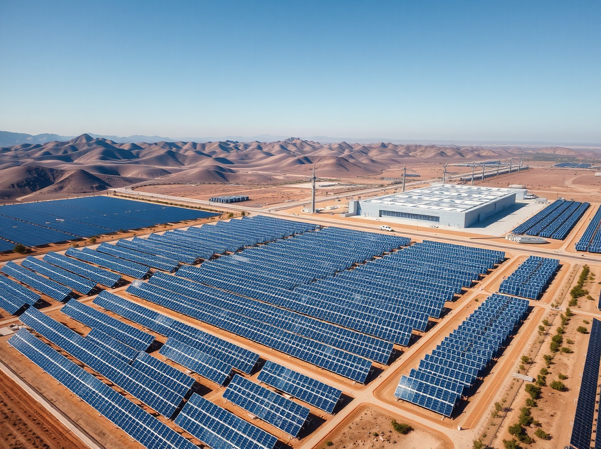

---

## Scale close or exceeding centralized

<!-- Column 1 -->

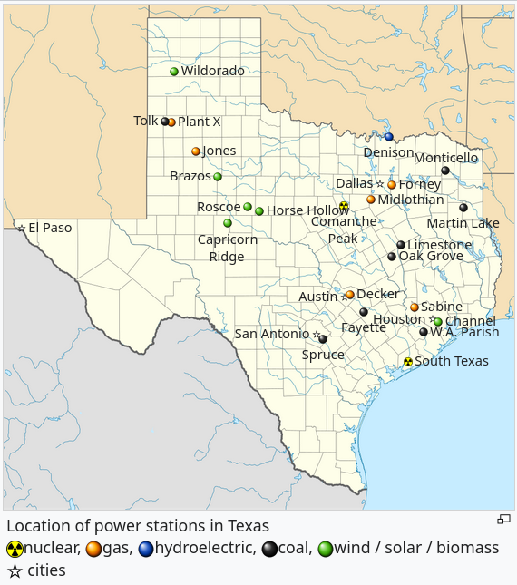

### Examples
Descending Capacity Order

| Name | Capacity(MW) |
|------|--------------|
|Sabine River Works | 2,124.0 |
|Forney Energy Center| 1,784.0 |
|Midlothian | 1,734.0 |
|Temple 1&2 | 1,500.0 |

---

## Fossil fuel candidates <i class="fa-solid fa-oil-well"></i>

Turbines can be powered by:

- **Diesel**
- **Field gas**: Gas extracted from a production well before it enters a natural gas processing plant [31][31].
- **CNG**: <mark>Compressed Natural Gas</mark>, mainly methane compressed at a pressure of 200 to 248 bars [32][32].
- **LPG**: <mark>Liquefied Petroleum Gas</mark>, a mixture of propane and butane liquefied at 15 °C and a pressure of 1.7-7.5 bars [32][32].
- **LowBTU gases**: Natural gas, which at the wellhead has a gross heating value $\le 450$ BTU. Part of petroleum refining and crude oil, natural gas production.

---

## Fuel Comparison <i class="fa-solid fa-square-poll-horizontal"></i>

| Comparison | CNG | LPG |
| ---------- | --- | --- |
| Constituents | Methane | Propane, Butane|
| Energy density | Lower caloric value | Higher caloric value |
| Cost | Cheaper | More expensive |
| Emissions| Less than LPG | Less than gasoline |
| Safety | Disperses quickly | Settles to ground, but highly inflammable |

CNG risk of ignition is low so even though LPG is highly inflammable it is the more likely of the two to ignite.

---

# Cooling <i class="fa-solid fa-snowflake"></i>

---

## Water <i class="fa-solid fa-droplet"></i> vs Air <i class="fa-solid fa-fan"></i>

<!-- Column 1 -->

Water is chosen because it is more thermally conductive than air
- Air: 0.026 \[W/mK\]
- Water: 0.6089 \[W/mK\] [37][37]

Thus the more energy efficient solution depend on a more and more direct heat dissipation from water or even special non-conductive liquids. 

<!-- Column 2 -->

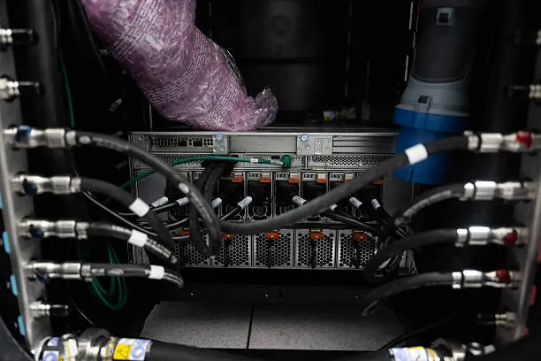

---

## Thermal conductivity <i class="fa-solid fa-temperature-high"></i>

The thermal conductivity of a material is a measure of its ability to conduct heat. It quantifies the proportionality between the heat flux $q$ and the temperature gradient $\nabla T$ in the direction of heat transport.

$$ q = -k \nabla T \ [W/mK]$$

- $q \ [W/m^2]$: heat flow rate per unit area
- $\nabla T \ [K/m]$: temperature gradient in the direction of heat transport

---

### Copper vs Aluminum <i class="fa-solid fa-weight-hanging"></i>

- Copper piping
- ✅ Great thermal conductivity[33][33]
    - Copper: $401 \ [W/mK]$
    - Aluminum: $205 \ [W/mK]$

- ❌ More expensive per tonne[34][34]
    - Copper: $12808\$/t$
    - Aluminum: $3385\$/t$

---

### Galvanic Corrosion <i class="fa-solid fa-triangle-exclamation"></i>

Galvanic is an electrochemical process that occurs when two metals with different electrochemical activity are in contact with each other (like copper and aluminum). 

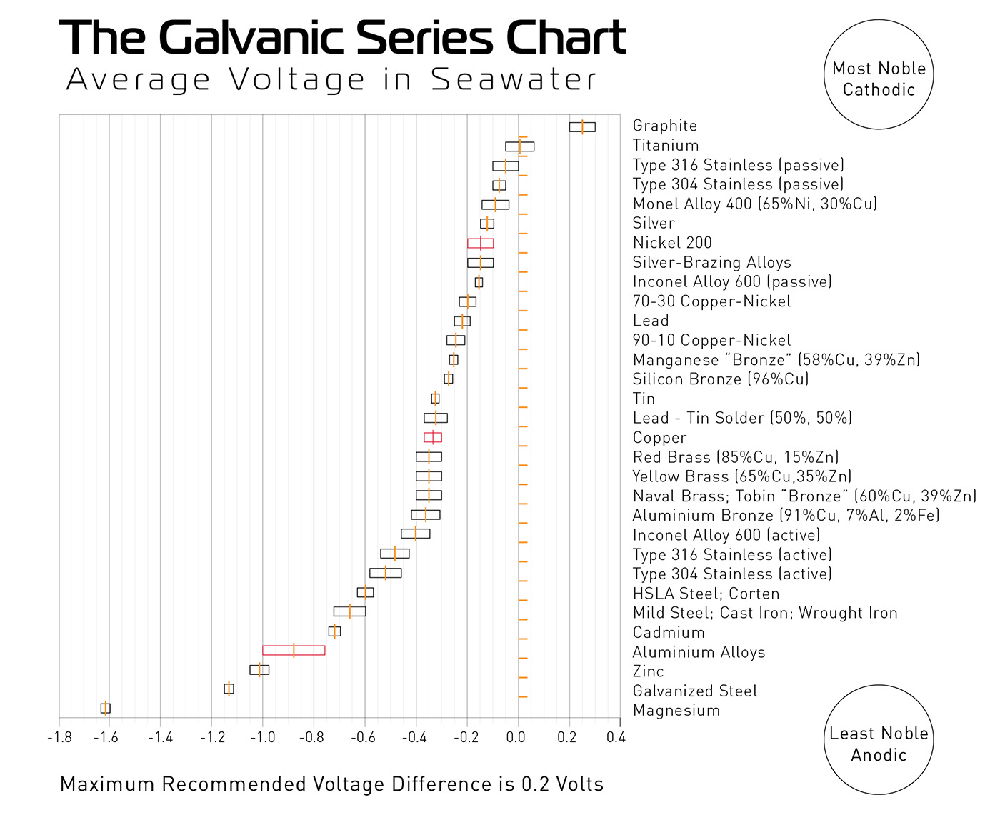

---

### Galvanic Corrosion <i class="fa-solid fa-triangle-exclamation"></i>

The more noble, passive metal (copper or nickel) drives the corrosion of the active, less noble metal (aluminum), where the passive metal remains fairly unharmed. [33][33]

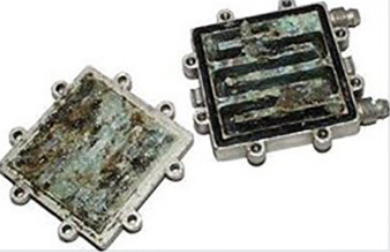

---

## Cooling types 

1. Computer Room Air Conditioning
2. Evaporative Cooling
3. Direct-To-Chip Cooling
4. Single-Phase Immersion Cooling
5. Multi-Phase Immersion Cooling [38][38]

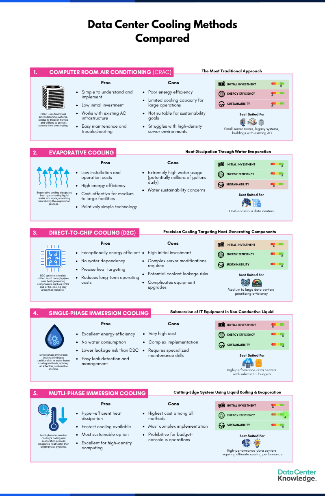

---

## Computer Room Air Conditioning (CRAC)

The origin of datacenter cooling. Rooms dedicated to housing IT equipped with traditional home use A.C. units.

| Metrics | Rating |
|-|-|
| Energy Efficiency <i class="fa-solid fa-bolt"></i> | 1/5 🟥 |
| Sustainability <i class="fa-solid fa-leaf"></i> | 1/5 🟥 |
| Initial Investment <i class="fa-solid fa-money-bill"></i> | 4/5 🟨|

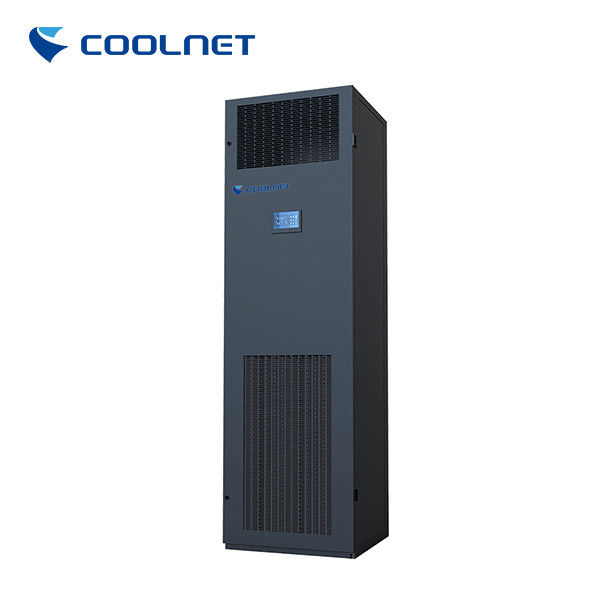

13KW CRAC

---

## Evaporative Cooling

Dissipates heat by converting liquid water into vapor, absorbing heat during the evaporation process.

<!-- Column 1 -->

2 ways:
- **Direct** evaporative cooling, where server room air passes through a water-soaked membrane
- **Indirect** evaporative cooling, which uses heat exchangers to cool air before pumping it into server rooms

<!-- Column 2 -->

| Metrics | Rating |
|-|-|
| Energy Efficiency <i class="fa-solid fa-bolt"></i> | 5/5 🟩 |
| Sustainability <i class="fa-solid fa-leaf"></i> | 2/5 🟧 |
| Initial Investment <i class="fa-solid fa-money-bill"></i> | 5/5 🟩 |

---

## Direct

The humidifier adds water to the incoming air stream:
- raising its humidity 
- reducing its temperature [50][50]
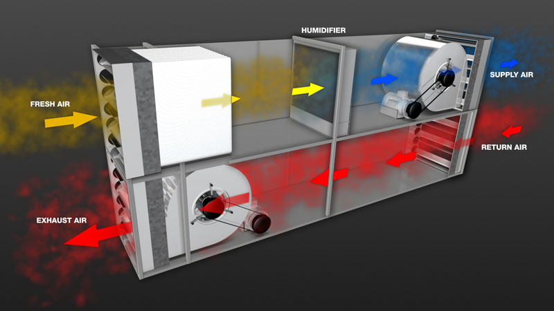

This conditioned air is then simply supplied to the room with a high percentage of the room air being exhausted rather than re-circulated to maintain a low humidity in the room.

---

## Indirect

Cool outside air is drawn through a heat recovery unit then immediately exhausted. Meanwhile internal air is drawn from the room and circulated through the heat recovery unit before being re-introduced to the room. The outside air’s cool thermal energy is thus transferred to the internal air via the heat recovery unit without the two streams directly mixing
[50][50]

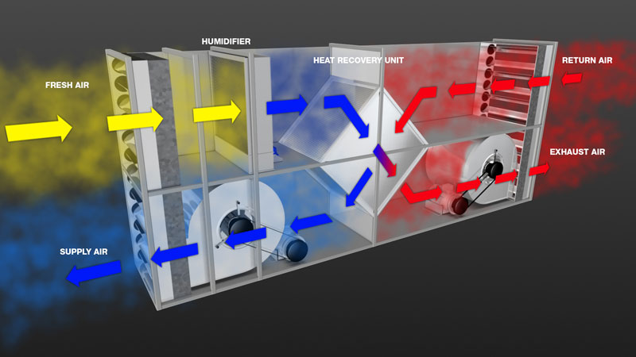

---

## Direct-To-Chip Cooling

D2C systems circulate chilled liquid through pipes near heat-generating components, such as CPUs and GPUs, cooling only areas that require it.

| Metrics | Rating |
|-|-|
| Energy Efficiency <i class="fa-solid fa-bolt"></i> | 5/5 🟩 |
| Sustainability <i class="fa-solid fa-leaf"></i> | 5/5 🟩 |
| Initial Investment <i class="fa-solid fa-money-bill"></i> | 2/5 🟧 |

Prone to system disruption (coolant leakage)

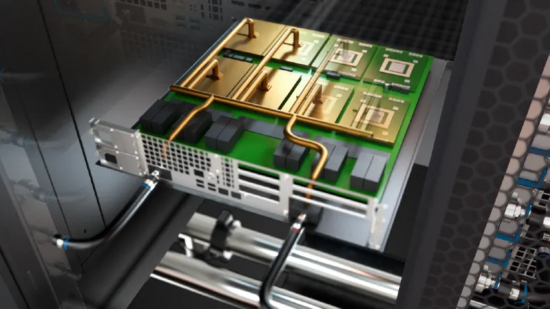

---

## Close up Look

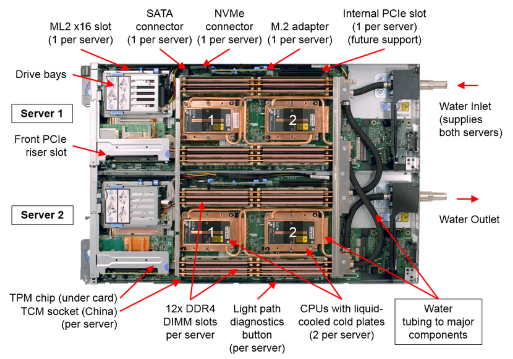

1 MW of server equipment costs 
$\quad\quad\quad\quad\quad$<i class="fa-solid fa-down-long"></i>

approximately 650,000$

---

## Single-Phase Immersion Cooling

Submerges IT equipment directly in non-conductive liquid that efficiently absorbs and dissipates heat. The leakage risk is lower than D2C cooling.

<!-- Column 1 -->

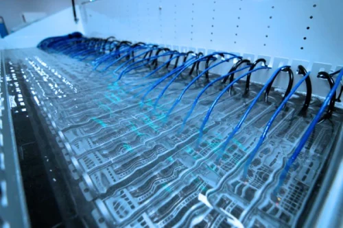

| Metrics | Rating |
|-|-|
| Energy Efficiency <i class="fa-solid fa-bolt"></i> | 5/5 🟩 |
| Sustainability <i class="fa-solid fa-leaf"></i> | 5/5 🟩 |
| Initial Investment <i class="fa-solid fa-money-bill"></i> | 1/5 🟥 |

1 MW of server equipment costs approximately 1 million $

---

## Multi-Phase Immersion Cooling

Improves on the previous method by replacing the liquid with a non-conductive liquid that boils when exposed to the equipment's heat. As the liquid evaporates, it efficiently removes heat, making it one of the fastest and most effective, most expensive  cooling solutions available.

<!-- Column 1 -->

| Metrics | Rating |
|-|-|
| Energy Efficiency <i class="fa-solid fa-bolt"></i> | **6/5** 🟩 |
| Sustainability <i class="fa-solid fa-leaf"></i> | 5/5 🟩 |
| Initial Investment <i class="fa-solid fa-money-bill"></i> | **0/5** 🟥 |

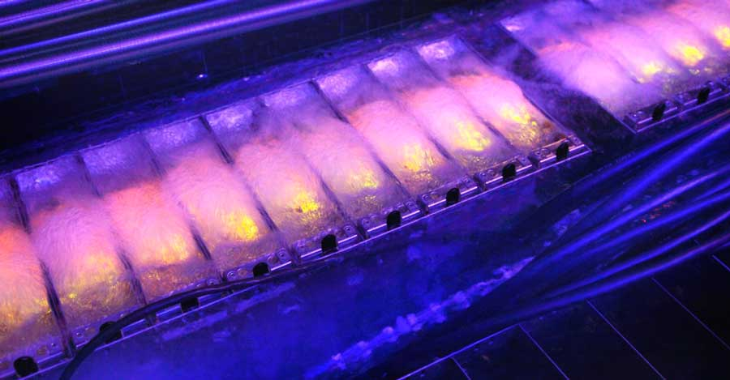

---

# Network $\quad$ topology <i class="fa-solid fa-network-wired"></i>

Network topology optimization

---

How are the cables routed 

---

# Environmental Impact <i class="fa-solid fa-leaf"></i>

The disruption observed to the nature's equilibrium

---

## Emissions <i class="fa-solid fa-smog"></i>

Diesel generators and Gas Turbines emit:

<!-- Column 1 -->

- Nitrogen oxides ($NO_x$)
- Carbon dioxide ($CO_2$)
- Carbon monoxide ($CO$)
- Sulfur oxides ($SO_x$)
- Unburned Hydrocarbons
- Smoke [51][51]

### Causing:
- Health problems
- 

---

## Water Shortage <i class="fa-solid fa-droplet"></i>

<!-- Column 1 -->

Most servers follow the <mark>Evaporative Cooling</mark> route because it has great energy efficiency while being cost effective. This means:
- Most of the water turns into steam 
- Then released into the atmosphere
- And taken out of immediate human usage

Leading to reduced availability for agriculture, drinking, and ecosystems.

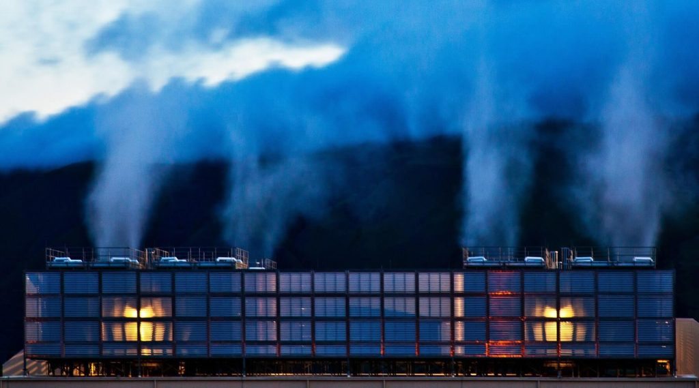

---

# Health Effects <i class="fa-solid fa-heart-pulse"></i>

The risks datacenters pose to the public's well being

---

## NOx - Nitrogen Oxides

Methane gas turbines pump harmful nitrogen oxides (mainly $NO_2$) into the air, which are known to cause:

- Lung irritation 
- Breathing difficulties
- Asthma
- Respiratory diseases 
- Cancer [4][4], [26][26], [6][6]

Children are especially susceptible to respiratory conditions. 

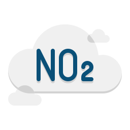

---

## Sustained audible noise pollution <i class="fa-solid fa-ear-listen"></i>

Constant sound exposure is associated with:
- Annoyance
- Disrupted sleep cycles
- Cardiovascular disorders
- Impaired cognitive development of children
- Worsened psychological and physical well-being [35][35]
- Seizures (audiogenic epilepsy) [36][36]

---

## Infrasound <i class="fa-solid fa-wave-square"></i>

<!-- Column 1 -->

Infrasound is low frequency sound  below the lower limit of human hearing (around 20Hz)  [1][1]

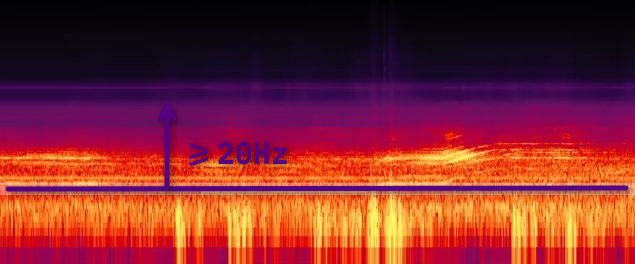

🟨: loud, Y-axis: frequencies, X-axis: time

<!-- Column 2 -->

### Known Health Effects [13][13]

- Spike in cortisol levels (stress, hyppertension) [14][14], [15][15]
- Nausea, Dizziness[12][12]
- Vibroacoustic disease [16][16]
- High frequency hearing loss [17][17]
- Shortness of breath [18][18]
- Anxiety, Depression [19][19]

---

# Finance <i class="fa-solid fa-money-bill"></i>

The economic side of the story

---

## Maximized Demand <i class="fa-solid fa-hand-holding-hand"></i>

In the process of building these Datacenters, companies are:

- Placing open-ended orders for memory effectively <i class="fa-solid fa-right-long"></i>
- Telling manufacturers they will buy as much as can be delivered, regardless of the price

Manufacturers are in return:

- Pivoting their factories away from making standard consumer memory to <i class="fa-solid fa-right-long"></i>
- Prioritize high-profit enterprise chips ( This affects both **RAM** and **Hard Disks**)

The AI build-out is colliding with a supply chain that cannot meet its physical requirements. [46][46], [47][47]

---

# Sociopolitical $\quad$ Aspects <i class="fa-solid fa-scale-balanced"></i>

The effects that reverberate throughout the 

---

## Job Creation <i class="fa-solid fa-briefcase"></i>

Stargate

- **100,000–200,000** construction and operations jobs [9][9]
- **~25,000** onsite jobs [11][11]
- Large automated data centers often need *only dozens* of permanent staff once built
- May only employ **~57** ongoing workers, despite promises of thousands [12][12]

---

## Post AI World jobs

Many companies announce layoffs to cut costs
tends to show that AI is a revolution like no other, one that doesnt fill the empty spots it created 

It isn't yet clear if AI will create more jobs than it replaced. The paper with the predictions[48][48]

---

## AI Occupational Exposure

Tasks which are heavily reliant on the standardized <mark>processing of textual information</mark>, are things AI is likely to be good at.

Tasks, which rely on in-person <mark>physical dexterity</mark>, are naturally less exposed to AI. (recent advancements in robotics question this) 

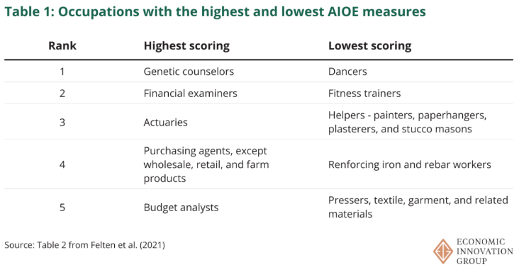

---

## Unemployment

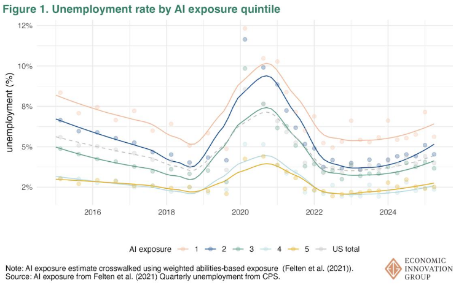

1. 
2. 
3. 
4. 
5. 

---

## Strategic Datacenter Placement <i class="fa-solid fa-republican"></i>

<!-- Column 1 -->

- Datacenters placement
- Republican states often tend to be less educated
- 
- Low backlash from <i class="fa-solid fa-republican"></i> communities near sites
-  

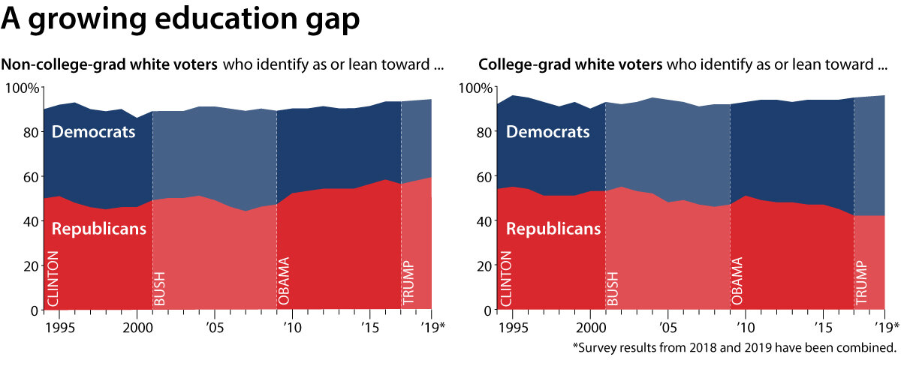

---

## Backlash

Monterey park protest

<!-- Column 1 -->

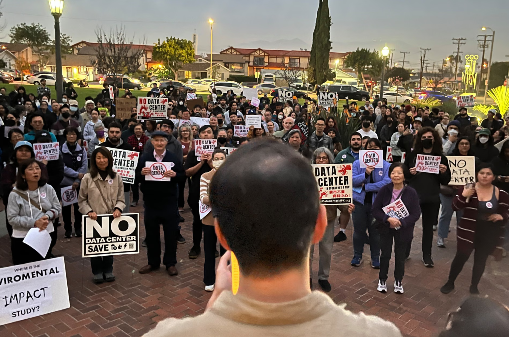

---

## Ownership

Shift towards cloud computing

- Less burden on the user's device <i class="fa-solid fa-laptop"></i>
- Can sell less powerful devices, useless without cloud computing assistance [40][40]
- Cloud storage, cloud gaming [43][43], cloud movies [41][41], cloud music [42][42], cloud AI, cloud everything <i class="fa-solid fa-cloud"></i>

Cloud services instigate subscription based models which degrade ownership.

---

# Datacenter Case Study <i class="fa-solid fa-server"></i>

The datacenters that are responsible for running the world's cloud services and facilitating the training of the most advanced LLMs

---

## Map

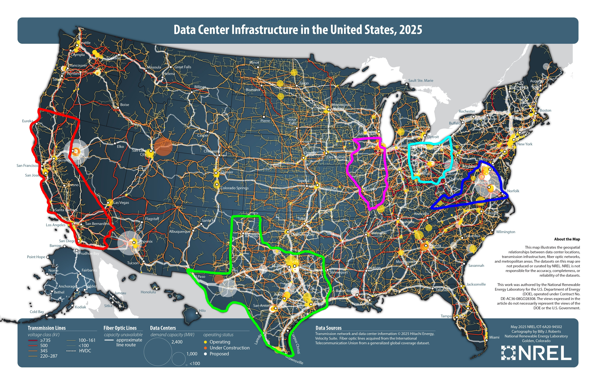

Most Activity

|<i class="fa-solid fa-ranking-star"></i>  | State |
|-|-|
| 1 |Virginia |
| 2 |Texas |
| 3 |California |
| 4 |Illinois |
| 5 |Ohio |

---

## LLM Facilities <i class="fa-solid fa-industry"></i>

| Datacenter | Location | Company | LLM |
| ---------- | -------- | ------- | --- |
| Stargate Project |  Michigan | OpenAI, Oracle | ChatGPT |
| Colossus | Memphis | xAI | Grok |
| Hyperion | Louisiana | Meta | Llama |
| Google Datacenter| Iowa | Google | Gemini |
| Fire-Flyer AI Cluster | Zhejiang | Fire-Flyer | Deepseek |

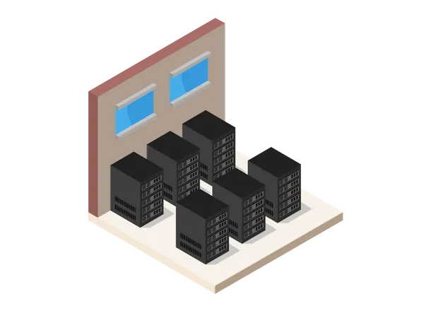

---

## Colossus

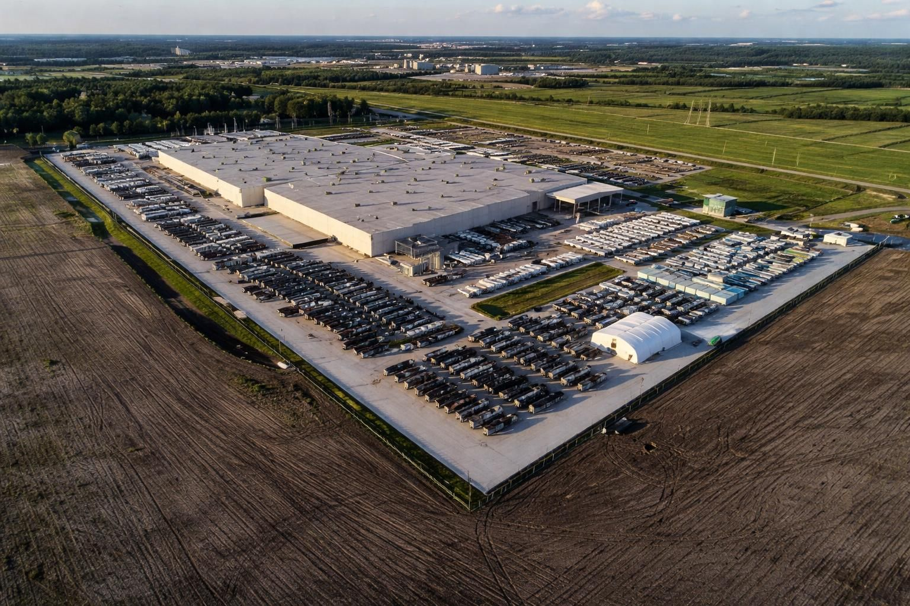

---

## Specifications <i class="fa-solid fa-file-pen"></i>

<!-- Column 1 -->

| Specs      | Value          |
|------------|----------------|
| Investment |  |
| Location   | Memphis, Texas |
| Company    | xAI |
| IT Capacity |  |

<!-- Column 2 -->
Good example because:
- AI usage
- centralized to one datacenter

---

## Server Hardware

~110,000 NVIDIA GB200 NVL72 GPUs (targeting 1.1 PFlops FP8 compute).
usually small fp numbers needed for 

---

## Methane Gas Turbines <i class="fa-solid fa-gas-pump"></i> 

Specifications:
- natural gas turbines for primary generation
- batteries for stability
- grid for long-term scalability

Elon Musk's xAI data center Methane gas turbines, Colossus. [24][24]

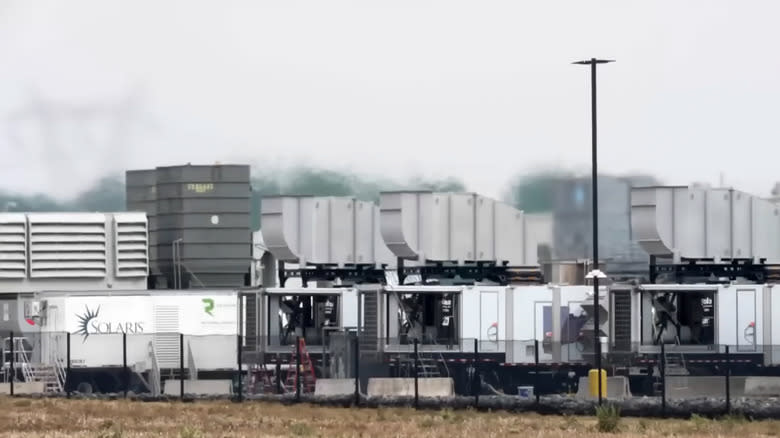

- 7 Solar Turbines Titan-350 [22][22]
- 12 Solar Turbines SMT-130 [23][23]

Solar Turbines: a Caterpillar subsidiary

---

## Solar Turbines Titan 350

<!-- Column 1 -->

|Specifications|Value|
|-|-|
|Power output|35-39MW|
|Thermal efficiency|~40%|
|Fuel types| Natural gas, Propane, Low BTU gases |

source[22][22], [24][24], [27][27] 

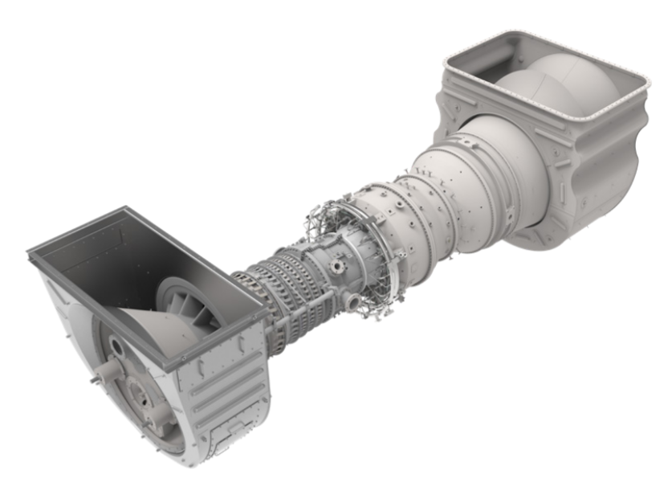

---

## Solar Turbines Titan 350

|Advanced Specifications|Value|
|-|-|
|Heat Rate| 8845 kJ/kW-hr - 8780 kJ/kW-hr |
|Exhaust Flow| 371980 kg/hr - 387820 kg/hr|
|Exhaust Temp| 460°C - 490°C|
|Emissions | 25 PPM NOx |

---

## Solar Turbines SMT 130

<!-- Column 1 -->

|Specification|Value|
|-|-|
|Power output|16MW|
|Thermal eff.|~36%|
|Fuel types| Field Gas, CNG, LPG |
|Heat Rate| 10160 kJ/kWe-hr |
|Exhaust Flow|202510 kg/hr|
|Exhaust T| 490°C|
|Emissions | 25 PPM NOx |

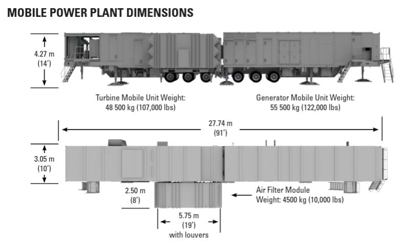

Fully-Integrated Mobile Power Plant *Powered by Titan 130* [23][23], [24][24], [28][28]
<mark> <i class="fa-solid fa-plus"></i>Added Diesel fuel support</mark>

---

## SoloNOx

SoloNOx is the technology enabling Solar Turbines to reduce NOx and CO emissions.[30][30]

Offers a robust:
- 9ppm NOx, 
- 15ppm CO, and 
- 15 ppm UHC 

emissions warranty for natural gas fuel.

---

## Available power

<mark>Titan 130 available power graph</mark>
As inlet air temperature increases the power the generator can produce decreases.

Why? 
> Colder inlet air means higher mass flow rate which in turn increases the power output [52][52]

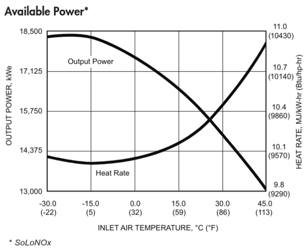

---

## Tesla Megapacks 

Megapacks [29][29] are large scale energy storage. <mark>*Many many* Batteries</mark>

Used for:
- Power Backup 
- Resilience for outages
- Demand-response
- Turbine ramping

They can provide 4 hours of power. They are planing to deploy 200 Megapack for about 1 gigawatt hour of buffering. Long term solar powered facility but near-term it is Megapacks and gas turbines that is being used as a bridge to the future.

---

## Sustainable Pledges <i class="fa-solid fa-solar-panel"></i>

xAI plans an 88-acre solar array to provide power to Colossus [44][44]

---

## Legally Ambiguous Operation

Electricity-generating turbines were exempt from requirements for air quality permits.

**Loophole**: Generators can operate without permits as long as the machines don't remain stationed for $\ge 1$ year.

xAI eventually received permits for 15 turbines at Colossus 1 and is now operating 12 permitted machines at the site.

Net annual nitrogen oxide emission reductions of up to 296 tons by 2032,” [4][4]

---

# Ambitious Projects

---

## Colossus

Colossus power generation around 1.1 GW by Q2 2027 and 2 GW total capacity

---

## Hyperion

- ~2 GW by 2030 and end goal 5GW. While Meta has agreements for 1.8 GW of solar and wind, 150 MW geothermal, and even nuclear power extensions, most current power is set to come from gas [45][45]

---

## Stargate 

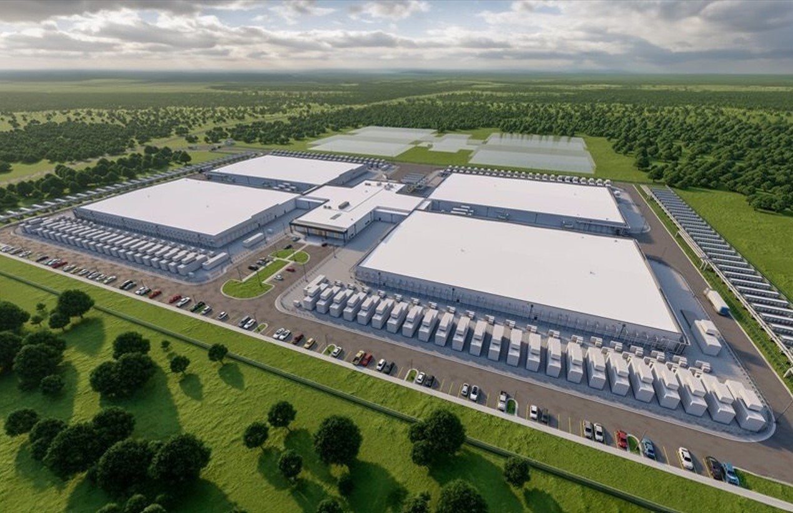

---

## Specifications <i class="fa-solid fa-file-pen"></i>

<!-- Column 1 -->

| Specs      | Value          |
|------------|----------------|
| Investment | $500 billion   |
| Location   | Abilene, Texas |
| Company    | OpenAI & Oracle|
| IT Capacity | 4.5 GW |

based on [10][10]

<!-- Column 2 -->

5 new sites
- Shackelford County, Texas
- Milam County, Texas
- Doña Ana County, New Mexico
- Lordstown, Ohio
- a mystery site located somewhere in America's Midwest.

End goal being 10GW of combined capacity.

---

## Chips

- Nvidia GB200 racks

<!-- ################# Sources ################# -->

[1]: https://youtu.be/_bP80DEAbuo "Datacenters Behaving Like Acoustic Weapons - Benn Jordan 2026"

[2]: https://sustainabilitydialogue.uchicago.edu/news/data-centers-pollution-and-the-communities-left-behind/ "Data Centers, Pollution, and the Communities Left Behind - The University of Chicago"

[3]: https://doi.org/10.1016/j.rser.2015.12.283 "Optimizing energy consumption for data centers"

[4]: https://www.theguardian.com/technology/2026/jan/15/elon-musk-xai-datacenter-memphis "Elon Musk’s xAI datacenter generating extra electricity illegally, regulator rules - TheGuardian"

[5]: https://sustainabilitydialogue.uchicago.edu/news/data-centers-pollution-and-the-communities-left-behind/ "Data Centers, Pollution, and the Communities Left Behind"

[6]: https://www.mississippifreepress.org/amazons-canton-data-center-promises-prosperity-for-neighbors-its-bringing-dust-noise-and-pollution-fears/ "Amazon’s Canton Data Center Promises Prosperity. For Neighbors, It’s Bringing Dust, Noise and Pollution Fears."

[7]: https://www.theguardian.com/us-news/2026/feb/07/california-monterey-park-stop-datacenter-construction "Rage against the machine: a California community rallied against a datacenter and won - TheGuardian"

[8]: https://www.theguardian.com/us-news/2025/dec/18/michigan-data-center-fight "‘Uniquely evil’: Michigan residents fight against huge datacenter backed by top tycoons - TheGuardian"

[9]: https://intuitionlabs.ai/articles/openai-stargate-datacenter-details "OpenAI’s Stargate Project: A Guide to the AI Infrastructure - Intuition Labs"

[10]: https://www.blackridgeresearch.com/blog/upcoming-largest-data-center-projects-in-united-states-usa "Blackridge Research - K.Vaishnavi Srivalli"

[11]: https://www.theregister.com/2025/09/24/openai_oracle_softbank_datacenters/#:~:text=While%20OpenAI%20claims%20the%20new,%C2%AE "OpenAI's Stargate project to pave the world with AI datacenters announces five new US locations - The Register"

[12]: https://www.cnbc.com/2025/02/06/openai-looking-at-16-states-for-data-center-campuses-tied-to-stargate.html#:~:text=The%20company%20also%20said%20it,jobs%2C%20according%20to%20recent%20reports "OpenAI considering 16 states for data center campuses as part of Trump’s Stargate project - CNBC"

[13]: https://doi.org/10.3390/ijerph20053916 "Low-Frequency Noise: Experiences from a Low-Frequency Noise Perceiving Population - PubMed"

[14]: https://doi.org/10.1016/j.neuroscience.2010.02.060 "Involvement of microglial cells in infrasonic noise-induced stress via upregulated expression of corticotrophin releasing hormone type 1 receptor - PubMed"

[15]: https://doi.org/10.1016/s0024-3205(01)01450-3 "Low frequency noise enhances cortisol among noise sensitive subjects during work performance - Science Direct" 

[16]: https://doi.org/10.1016/j.pbiomolbio.2006.07.011 "Vibroacoustic disease: Biological effects of infrasound and low-frequency noise explained by mechanotransduction cellular signalling - Science Direct"

[17]: https://doi.org/10.1016/j.heares.2007.01.016 "Effect of infrasound on cochlear damage from exposure to a 4-kHz octave band of noise - NIH"

[18]: https://pubmed.ncbi.nlm.nih.gov/15703146/ "Effects of low frequency noise on man, a case study - NIH"

[19]: https://doi.org/10.1038/s41598-021-82203-6 "A longitudinal, randomized experimental pilot study to investigate the effects of airborne infrasound on human mental health, cognition, and brain structure - NIH"

[20]: https://openai.com/index/five-new-stargate-sites/ "OpenAI, Oracle, and SoftBank expand Stargate with five new AI data center sites - OpenAI"

[21]: https://openai.com/index/stargate-advances-with-partnership-with-oracle/ "Stargate advances with 4.5 GW partnership with Oracle - OpenAI"

[22]: https://s7d2.scene7.com/is/content/Caterpillar/CM20220318-18bf4-966d4 "Titan 350, Gas Turbine Compressor Set - Solar Turbines"

[23]: https://s7d2.scene7.com/is/content/Caterpillar/CM20201215-9943b-379e0 "SMT130, SOLAR MOBILE TURBOMACHINERY - Solar Turbines"

[24]: https://www.nextbigfuture.com/2025/09/xai-colossus-2-first-gigawatt-ai-data-center.html "XAI Colossus 2 First Gigawatt AI Data Center - nextBIGFUTURE"

[25]: https://www.sgvtribune.com/2025/12/04/monterey-park-pauses-vote-on-massive-proposed-data-center-as-questions-linger-over-impact/ "Monterey Park pauses vote on massive proposed data center, as questions linger over impact - San Gabriel Valley Tribune"

[26]: http://dx.doi.org/10.20431/2456-0596.0204008 "Public Health Issues from the Exposure to Nitrogen Oxides: A Brief Review - ARC Journal of Public Health and Community Medicine"

[27]: https://www.solarturbines.com/en_US/products/power-generation-packages/titan-350-38mw.html#tabs-f0c2557302-item-180d94bbbb-tab "Titan 350, 38 MW - Solar Turbines"

[28]: https://s7d2.scene7.com/is/content/Caterpillar/CM20150703-52095-43744 "Titan 130 Specsheet - Solar Turbines"

[29]: https://www.tesla.com/megapack "Tesla Megapack - Tesla"

[30]: https://www.solarturbines.com/en_US/services/equipment-optimization/system-upgrades/safety-and-sustainability/solonox-upgrades.html "SoLoNOx Upgrade - Solar Turbines"

[31]: https://www.law.cornell.edu/definitions/index.php?width=840&height=800&iframe=true&def_id=3b13a2b19ee30cdd89249f2ddd2f5b65&term_occur=999&term_src=Title:40:Chapter:I:Subchapter:C:Part:68:Subpart:A:68.3 "Field gas definition - Law cornell"

[32]: https://www.diffen.com/difference/CNG_vs_LPG "CNG vs LPG - Diffen"

[33]: https://www.ekwb.com/blog/aluminium-vs-copper/ "Copper vs Aluminum - LMTEK"

[34]: https://www.alcircle.com/news/assessing-if-aluminium-is-ready-to-take-up-coppers-share-of-demand-in-renewables-evs-and-data-centres-117556 "Assessing if aluminium is ready to take up copper’s share of demand in renewables, EVs and data centres - Alcircle"

[35]: https://doi.org/10.1080/00139157.2022.2046456 "Here, There, and Everywhere: How the SDGs Must Include Noise Pollution in Their Development Challenges - Tandfonline"

[36]: https://www.droracle.ai/articles/125906/can-excessive-sound-exposure-trigger-seizures "Can excessive sound exposure trigger seizures?"

[37]: https://en.wikipedia.org/wiki/Thermal_conductivity_and_resistivity "Thermal conductivity and resistivity - Wikipedia"

[38]: https://www.datacenterknowledge.com/cooling/data-center-cooling-methods-costs-vs-efficiency-vs-sustainability "Data Center Cooling Methods: Costs vs. Efficiency vs. Sustainability - Datacenter Knowledge, Christopher Tozzi"

[39]: https://www.csmonitor.com/USA/Politics/2020/1027/As-college-grads-flee-the-GOP-political-diploma-divide-grows "As college grads flee the GOP, political ‘diploma divide’ grows - The Christian Science Monitor" 

[40]: https://www.microsoft.com/en-us/windows-365/link "Windows 365 Link - Microsoft"

[41]: https://www.netflix.com/ "Netflix"

[42]: https://open.spotify.com/ "Spotify"

[43]: https://www.xbox.com/en-us/play "XBox Cloud Gaming"

[44]: https://www.datacenterdynamics.com/en/news/xai-submits-application-for-88-acre-solar-array-at-colossus-supercomputer-in-memphis-tennessee/ "xAI submits application for 88-acre solar array at Colossus supercomputer in Memphis, Tennessee - Datacenter Dynamics"

[45]: https://www.datacenterfrontier.com/hyperscale/article/55310441/ownership-and-power-challenges-in-metas-hyperion-and-prometheus-data-centers "Meta’s Dual-Track Data Center Strategy: Owning AI Campuses, Leasing Cloud, and Expanding Nationwide - Data center Frontier"

[46]: https://www.reuters.com/world/china/ai-frenzy-is-driving-new-global-supply-chain-crisis-2025-12-03/ "The AI frenzy is driving a memory chip supply crisis - Reuters"

[47]: https://www.consumerreports.org/electronics-computers/laptops-chromebooks/ai-data-centers-buying-up-ram-and-raising-laptop-prices-a3637558313/ "With AI Data Centers Scooping up RAM, Laptop Prices Could Spike in 2026 - Consumer Reports"

[48]: https://eig.org/wp-content/uploads/2025/08/EIG-AI-and-Jobs.pdf "AI and Jobs: The Final Word (Until the Next One) - Economic Innovation Group"

[49]: https://en.wikipedia.org/wiki/Distributed_generation "Distributed generation - Wikipedia"

[50]: https://www.condair.sg/knowledge-hub/direct-and-indirect-evaporative-cooling-strategies "Direct and indirect evaporative cooling strategies"

[51]: https://www.eplptx.com/wp-content/uploads/2020/05/Gas-Turbine-Emissions-and-Control.pdf "Gas Turbine Emissions and Control - GE Power Systems"

[52]: https://www.researchgate.net/publication/288265906_Comparison_of_different_gas_turbine_inlet_air_cooling_methods "Comparison of Different Gas Turbine Inlet Air Cooling Methods - Research Gate"

[53]: https://www.datacenterdynamics.com/en/news/greenpeace-chinas-data-centers-are-primarily-coal-powered-emit-99m-tonnes-co2/ "Greenpeace: China's data centers are primarily coal powered, emit 99m tonnes of CO2 - Datacenter Dynamics"