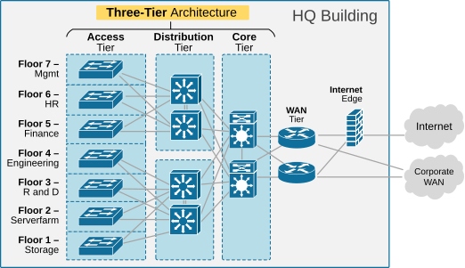
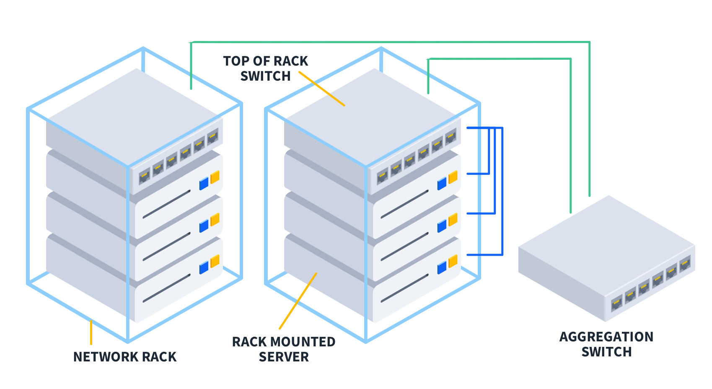
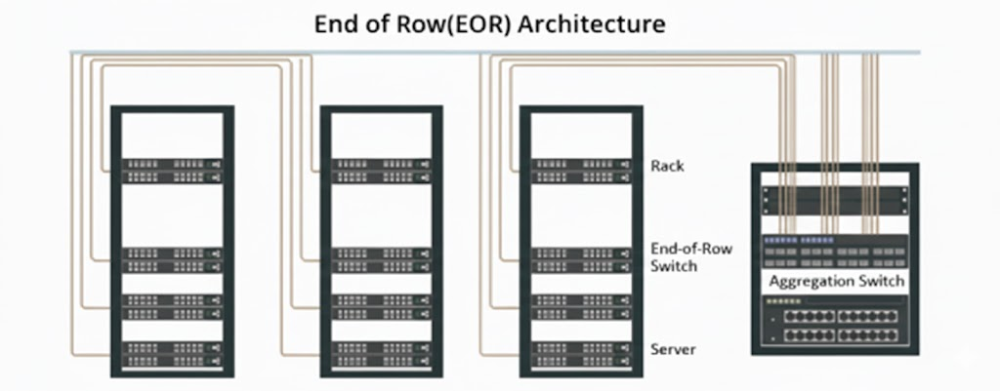
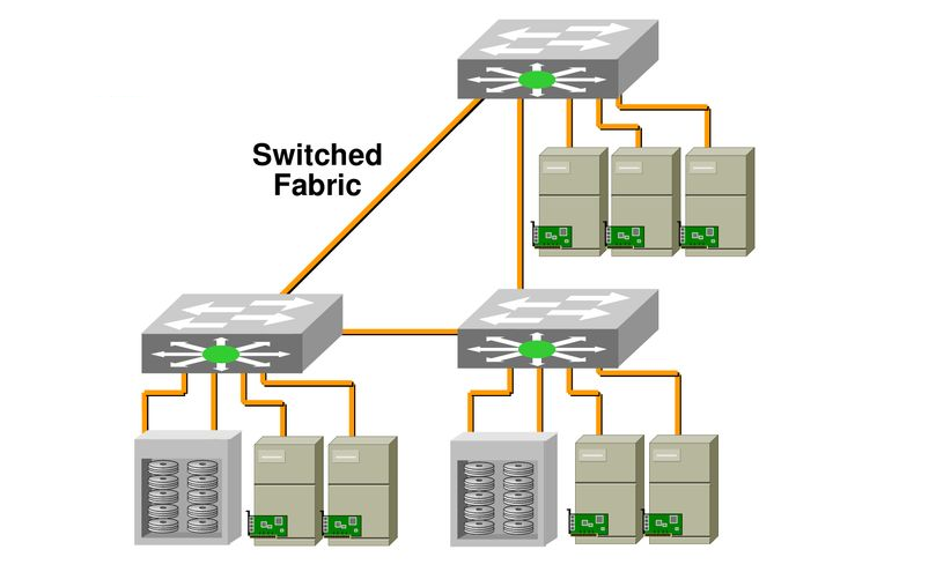

# Network $\quad$ topology <i class="fa-solid fa-network-wired"></i>

Optimizing performance through efficient cable routing

<!--
Συνεχίζοντας θα εξετάσουμε τις τοπολογίες δικτύου που χρησιμοποιούνται για την επίτευξη υψηλότερων επιδόσεων
-->

---

## Definition

In datacenter when using the term network topology we refer to the <mark>structure and layout of networking equipment</mark> and its relationship to servers. [57][57]

<!--
Όταν μιλάμε για τοπολογία δικτύου εννοούμε την δομή και διάταξη υλικού δικτύωσης με σημείο αναφοράς τους servers.
-->

---

## Importance

1. **Performance**: Minimization of server to external endpoints latency
2. **Scalability**: Ability to adapt to increasing network traffic demands 
3. **Cost-Effectiveness**: Effective use of networking hardware as to not overspend meaninglessly or even reduce performance
4. **Security**: Server isolation and malicious traffic filtering [57][57]

<!--
Οι βασικοί λόγοι για τους οποίους είναι σημαντική η βελτιστοποίηση δικτύου είναι:
- Η αύξηση των επιδόσεων μειώνοντας την καθυστέρηση επικοινωνίας μεταξύ server και χρηστών.
- Η επεκτασιμότητα του δικτύου για την κάλυψη αυξημένων αναγκών της εγκατάστασης
- Η ελαχιστοποίηση του κόστους
- Και τέλος η αναβάθμιση της ασφάλειας μέσω της απομόνωσης συγκεκριμένων τμημάτων του δικτύου
-->
---

## Broadcasting vs Fiber Switching

---

## 3 Tier Topology <i class="fa-solid fa-chart-diagram"></i>

1. **Access tier**: Provides direct connectivity to end-user devices, enabling communication with the network.
2. **Distribution tier**: Acts as an intermediary by aggregating traffic from access switches and enforcing policies to manage routing and security.
3. **Core tier**: Ensures high-speed, reliable interconnection between distribution layers and external networks, handling backbone traffic.

<!--
Η βασική τοπολογία που χρησιμοποιείται στα datacenters είναι οι τοπολογία τριών βαθμίδων

- Η βαθμίδα πρόσβασης

- Η βαθμίδα διανομής 

- Και η βαθμίδα πυρήνα
-->

---

##

Bad scaling because of few switches and routers. Upgrade means buying more expensive hardware. Multiple racks can be connected to a single switch. Top-of-rack designs may also reduce efficiency in situations where a server rack doesn’t send or receive enough traffic to utilize its switches at full capacity.  three-tier topology is typically not ideal for data centers whose network traffic volumes fluctuate, although it can work well when traffic levels are consistent and predictable. [58][58], 

---

## Top-of-Rack vs End-of-Row $\quad\quad\quad\quad$ Switch Placement <i class="fa-solid fa-hexagon-nodes"></i>

Each server rack has its own switch. Uses more and less-expensive switches. Scales naturally based on datacenter capacity. Hard to maintain due to volume of networking hardware.

---

---

## Switched Fabric

Similar to 3 Tier topology but with extra switches making it more scalable. Its shortcoming is the increased complexity and the difficulty to design and implement. Maintaining it is also hard since the team would have to balance traffic and continuously restructure links between servers and the switch fabric. [61][61]

| Attribute | Score |
|-|-|
| Scalability  | 3/5 |
| Cost-Effectiveness | 3/5 |
| Maintenance | 1/5 |

